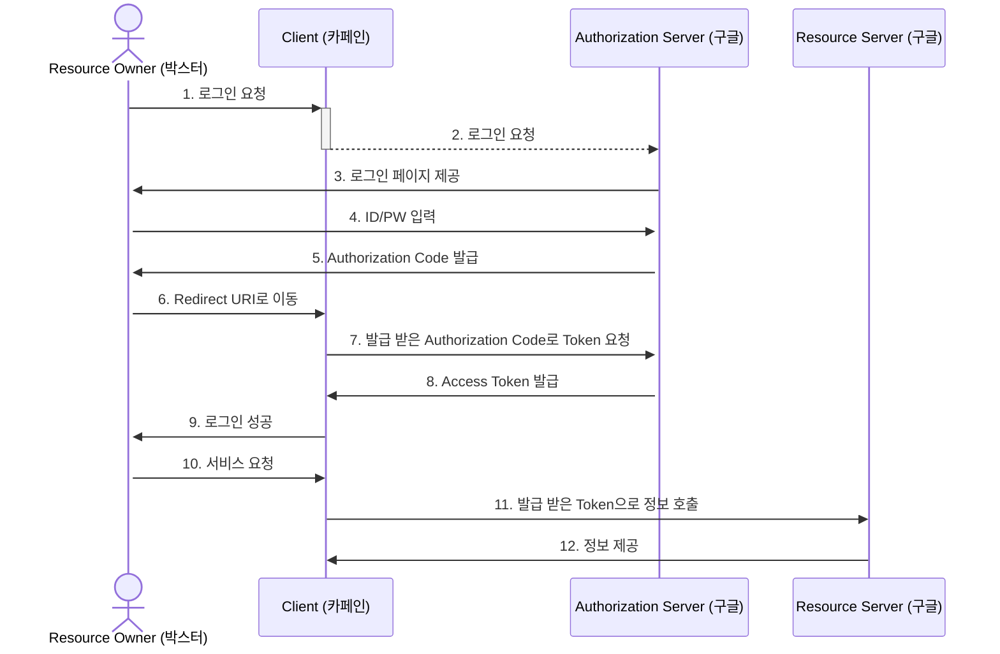
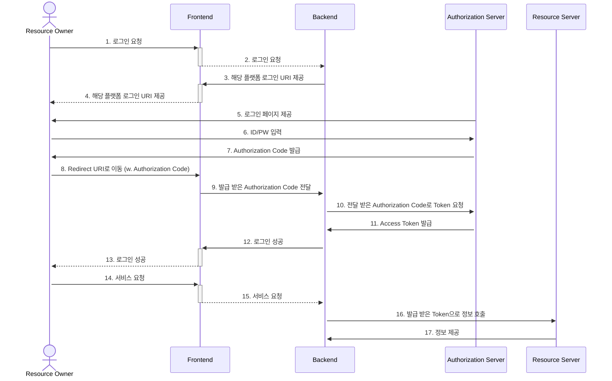

## OAuth 2.0 ?


> OAuth("Open Authorization")는 인터넷 사용자들이 비밀번호를 제공하지 않고 다른 웹사이트 상의 자신들의 정보에 대해 웹사이트나 애플리케이션의 접근 권한을 부여할 수 있는 공통적인 수단

위키 백과에서는 위와 같이 설명하고 있습니다. 우리가 google과 같은 웹 사이트에 회원가입을 하고 저장해둔 이름, 이메일, 프로필 이미지 같은 정보를
굳이 한번 더 입력하지 않고도 다른 웹 사이트에서 사용할 수 있는 것 입니다. 그리고 다른 웹 사이트를 사용하더라도 google에서 로그인을 하는 과정을 거치기 때문에, 사용자는
비밀번호나, critical한 개인정보 같은 것을 한 곳에서 관리할 수 있다는 장점이 있습니다.

다시 한번 정리하자면 우리 웹 사이트의 사용자가 이용하는 다른 웹 사이트의 정보를 사용할 수 있게끔 다른 웹 사이트에서 권한을 위임 받는 것 입니다.

### OAuth flow


OAuth Flow를 설명하기 전에 여기서 모르는 단어들이 많습니다.
해당 [링크](https://datatracker.ietf.org/doc/html/draft-ietf-oauth-v2-16#section-1.1)에서 더 자세하게 정리 되어있지만 설명해보겠습니다.

#### Resource Owner
Resource Owner는 말 그대로 리소스 소유자이고, 구글과 같은 플랫폼에 회원가입이 되어있는, 즉 구글에 자신의 정보들이 있는 사용자입니다.

#### Client
Client도 말 그대로 고객입니다. 하지만 어떤 관점에서 보느냐 고객이란 뜻은 달라집니다. 여기서는 Google과 같은 플랫폼에서 제공받은 리소스를 사용하는 고객입니다.
즉 우리의 서비스가 Client가 되는 것입니다. 왜냐면 우리는 구글에 정보를 요청하고 우리의 서비스에서 사용하기 때문입니다.

#### Authorization Server
여기도 말 그대로 인증 서버입니다. Resource Owner가 올바른 정보를 입력했는지 검증하고, 발급 받은 Code와 Token이 올바른 것인지 검증합니다.

#### Resource Server
Resource Owner의 정보들을 가지고 있는 서버입니다. 인증 서버에서 인증을 마치고 난 뒤 우리는 Resource를 받습니다.

하지만 여기서 Authorization Server 와 Resource Server가 나뉘어진 이유는 딱히 없습니다. **해당 플랫폼의 서버 구성에 따라 다를 수 있습니다.**

중요한 것은 **Authorization Server**와 **Resource Server**가 같은 묶음이라는 것 입니다.



간단하게 flow를 도식화 했습니다.

1. 먼저 Resource Owner는 로그인을 하고 싶다면 Client가 제공하는 해당 Resource platform의 URI를 클릭합니다. 그리고 인증서버에서 로그인 페이지를 제공 받습니다.
2. 그리고 Resource Owner는 ID/PW를 입력하고 Authorization Code를 발급 받습니다. 동시에 Client에서 등록해놓은 Redirect URI로 code와 함께 이동합니다.
3. Client는 Resource Owner에게 받은 Code를 가지고 Authorization Server에 토큰을 요청합니다. 그리고 받은 토큰을 저장합니다.
4. 그리고 Client는 로그인을 성공하고 이후 다른 platform에서 정보를 필요하게 된다면 저장한 Access Token을 통해 Resource Server에서 정보를 가져옵니다.

근데 여기서 이상한 점이 있습니다. 이상하다기보단 왜 이렇게 복잡한가 라는 의문을 가질 수 있습니다.


굳이 Authorization code를 받아 다시 한번 더 Access Token을 받아야 한다는 부분입니다. 바로 **Client에게 Access Token을 준다면 통신이 한번 줄어들 수 있지 않을까??**

보안문제 때문입니다.
만약 바로 Access Token을 준다면 그 Access Token이 탈취 당하면 해당 Resource Owner의 모든 정보에 접근할 수 있게 됩니다.
Code는 Secret Key와 같이 전달해야 Access Token을 발급 받을 수 있기 때문에 탈취되어도 더 안전합니다.
하지만 다른 플랫폼에서 Code나 Token이나 해당 정보를 전달할 방법은 URI에 전달하는 방법뿐 입니다.
그렇기 때문에 Redircet URI에 Access Token을 담는다면 탈취 가능성이 커지기 때문에 보안문제가 발생합니다.


### 백엔드와 프론트엔드의 flow


아까 Client 부분을 좀 더 Frontend, Backend로 구분지어 세분화 해봤습니다. 복잡해보이지만, 전혀 어렵지 않습니다. 아까 설명했던 흐름과 다른 부분은 없습니다.


또 여기서는 굳이 제가 Authorization Server에서 Code를 받아올 때 Redirect URI를 백엔드 서버로 하지않고 프론트엔드 서버로 하려는 이유는 Resource Owner가 다른 platform과 인증하는 부분은 백엔드의 역할이 아니라고 생각했습니다.
그리고 백엔드는 Resource Owner가 가져온 code를 프론트엔드에서 전달 받아 Resource Server에 정보를 요청하는 것이라고 생각했습니다.
***(물론 제 개인적인 의견이라 정답은 아닙니다.)***


## OAuth 구현해보기

간단히 Spring Security 없이 OAuth 인증을 구현해보겠습니다.

제일 먼저 구글 혹은 다른 플랫폼에서 설정한 id, secret key 등등의 정보를 yml에 작성했습니다.
```yml title="application-oauth.yml"
oauth2:
  provider:
    google:
      id: google-id
      secret: google-secret-key
      redirect-url: http://localhost:8080/login/oauth2/code/google
      token-url: https://www.googleapis.com/oauth2/v4/token
      info-url: https://www.googleapis.com/oauth2/v2/userinfo
```
그리고 OAuth는 어느 플랫폼이 될 지 모르고, 확장성 있게 구성하는 것이 좋을 것 같아 인터페이스로 만들었습니다.
```java title="OAuthMember.java"
public interface OAuthMember {
    String id();
    String email();
    String nickname();
    String imageUrl();
}
```
이러한 클래스들을 관리하기 쉽게 Enum을 추가합니다.

```java title="Provider.java"
public enum Provider {

    GOOGLE("google", GoogleMember::new),
    ;

    private final String providerName;
    private final Function<Map<String, Object>, OAuthMember> function;

    Provider(String providerName, Function<Map<String, Object>, OAuthMember> function) {
        this.providerName = providerName;
        this.function = function;
    }

    public static Provider from(String name) {
        return Arrays.stream(values())
                .filter(it -> it.providerName.equals(name))
                .findFirst()
                .orElseThrow(() -> new RuntimeExceptin());
    }

    public OAuthMember getOAuthProvider(Map<String, Object> body) {
        return function.apply(body);
    }
}
```
해당 Enum은 두개의 필드를 가지고 있습니다. 하나는 해당 플랫폼의 이름, 그리고 `Map<String, Object>`를 아까 만들었던 인터페이스로 반환하는 Function 여기서
`Map<String, Object>`로 지정해준 이유는, 플랫폼마다 반환되는 JSON 타입이 다르기 때문에 그런 부분에 대해 중복을 제거하기 위해 이러한 형태로 만들었습니다.

그리고 아까 yml에 작성했던 정보들을 가져와야합니다. `@Value` 어노테이션으로도 가져올 수 있습니다.
```java
        @Value("oauth.provider.google.id")
        private String id;
        @Value("oauth.provider.google.secret")
        private String secret;

        ...
```
하지만 이렇게 계속 binding을 해줘야한다는 점이 아주 귀찮고 보기도 안좋습니다.
```groovy title="build.gradle"
annotationProcessor "org.springframework.boot:spring-boot-configuration-processor"
```
하지만 위의 의존성을 추가해준다면 아주 편하게 property를 가져올 수 있습니다.

```java title="OAuthProviderProperties.java"
@Component
@ConfigurationProperties(prefix = "oauth2")
public class OAuthProviderProperties {
    // prefix oauth2 기준으로 알아서 google이 이름인 Provider Enum을 찾아서 Key로 바인딩
    private final Map<Provider, OAuthProviderProperty> provider = new EnumMap<>(Provider.class);

    public OAuthProviderProperty getProviderProperties(Provider provider) {
        return this.provider.get(provider);
    }

    @Getter
    @Setter
    public static class OAuthProviderProperty {
        // 그리고 provider 하위 정보들은 아래의 필드에 바인딩
        private String id;
        private String secret;
        private String redirectUrl;
        private String tokenUrl;
        private String infoUrl;
    }
}
```
이렇게 되면 구조적인 준비는 끝났습니다.

이제는 해당 플랫폼에 정보를 요청하는 작업만 하면 됩니다.
그럼 아까 말씀드렸던 순서로 요청을 해보겠습니다.

```java title="RestTemplateOAuthRequester.java"
public class RestTemplateOAuthRequester implements OAuthRequester {

    @Override
    public OAuthMember login(OAuthLoginRequest request) {
        // frontend에서 받아온 로그인 platform
        Provider provider = Provider.from(request.provider());
        // 해당 Platform에 맞는 정보 찾음
        OAuthProviderProperty property = oAuthProviderProperties.getProviderProperties(provider);
        // frontend에서 받아온 code와 등록해놓은 property로 Access Token 요청
        OAuthTokenResponse token = requestAccessToken(property, requet.getCode());
        // 받아온 Token으로 해당 Resource Owner의 정보 요청
        Map<String, Object> userAttributes = getUserAttributes(property, token);
        return provider.getOAuthProvider(userAttributes);
    }

    private OAuthTokenResponse requestAccessToken(OAuthProviderProperty property, String code) {
        HttpHeaders headers = new HttpHeaders();
        headers.setBasicAuth(property.getId(), property.getSecret());
        headers.setContentType(MediaType.APPLICATION_FORM_URLENCODED);

        HttpEntity<MultiValueMap<String, String>> request = new HttpEntity<>(headers);
        URI tokenUri = getTokenUri(property, code);
        return restTemplate.postForEntity(tokenUri, request, OAuthTokenResponse.class).getBody();
    }

    private URI getTokenUri(OAuthProviderProperty property, String code) {
        return UriComponentsBuilder.fromUriString(property.getTokenUrl())
                .queryParam(CODE, URLDecoder.decode(code, StandardCharsets.UTF_8))
                .queryParam(GRANT_TYPE, AUTHORIZATION_CODE)
                .queryParam(REDIRECT_URI, property.getRedirectUrl())
                .build()
                .toUri();
    }

    private Map<String, Object> getUserAttributes(OAuthProviderProperty property, OAuthTokenResponse tokenResponse) {
        HttpHeaders headers = new HttpHeaders();
        headers.setBearerAuth(tokenResponse.accessToken());
        headers.setContentType(MediaType.APPLICATION_JSON);
        URI uri = URI.create(property.getInfoUrl());
        RequestEntity<?> requestEntity = new RequestEntity<>(headers, HttpMethod.GET, uri);
        ResponseEntity<Map<String, Object>> responseEntity = restTemplate.exchange(requestEntity, new ParameterizedTypeReference<>() {
        });
        return responseEntity.getBody();
    }
}
```

이렇게만 한다면 그 어려워 보이던 OAuth 인증도 간단하게 해결할 수 있습니다.
***(물론 제 코드가 정답이 아닙니다)***
