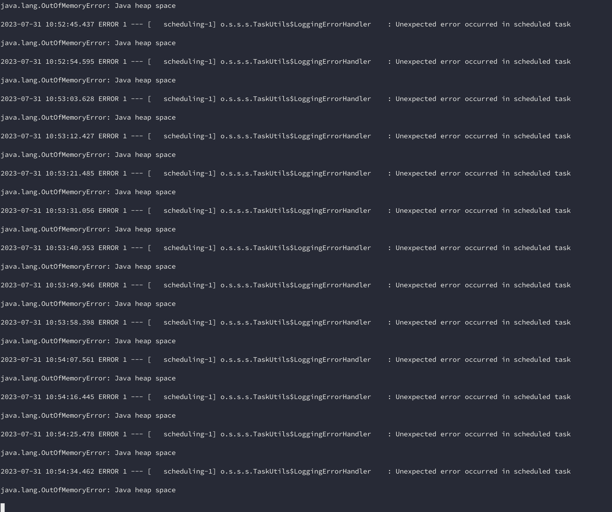
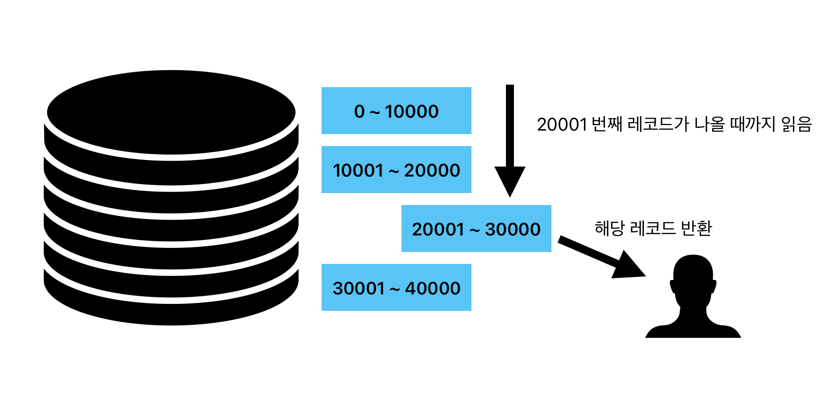
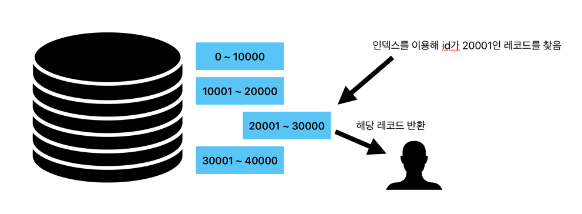
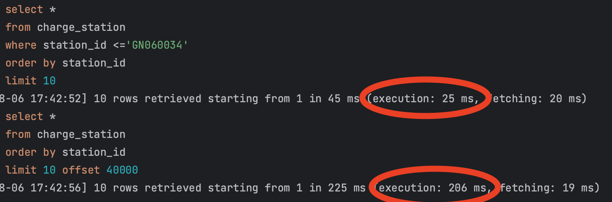
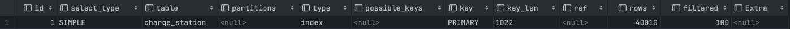
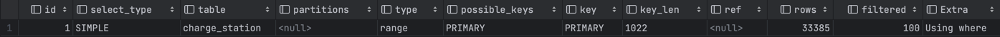
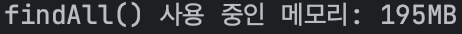

안녕하세요 부릉부릉 허리케인 박스터입니다.
## 이 글을 쓰는 이유
먼저 이 글을 쓰는 이유는 저희 카페인 팀의 충전소와 충전기들의 새로운 정보를 업데이트하거나, 저장하는 로직에서 아래와 같이 OOM(Out of memory)가 발생했기 때문입니다.


### 왜 발생했을까

먼저 간단히 저희가 처한 상황에 대해 설명드리겠습니다.

처음 어플리케이션을 실행하면 공공 API를 호출하여 충전소와 충전기에 대한 모든 정보들을 가져와 저장합니다. (충전소 약 6만 곳 + 충전기 약 23만 기)

하지만 이러한 정보들은 수정이 될 수 있고, 충전소와 충전기가 추가될 수 있습니다.

그러므로 정확한 정보가 사용자에게 가장 중요시되는 서비스에서 이러한 정보들이 늦게 반영이 된다거나, 반영이 되지 않는다면 저희 서비스를 사용할 사용자가 없을 것이라 판단했습니다.

그래서 하루에 한 번 충전소와 충전기들의 정보를 업데이트하고, 추가된 충전소와 충전기를 저장하는 로직을 만들었습니다.

대략적인 로직은 아래와 같습니다.
```java
    public void updatePeriodicStations() {
        List<Station> stations = requestStations();
        stationUpdateService.updateStations(stations);
    }

    public void updateStations(List<Station> updatedStations) {
        List<Station> stations = stationRepository.findAllFetch();

        Map<String, Station> savedStationsByStationId = stations.stream()
                .collect(Collectors.toMap(Station::getStationId, Function.identity()));

        // 저장된 정보와 비교하여 새로운 충전소와 충전기를 찾는 로직
        ...

        saveAllStations(toSaveStations);
        updateAllStations(toUpdateStations);

        saveAllChargers(toSaveChargers);
        updateAllChargers(toUpdateChargers);
    }

```
간단하게 말씀드리면 `requestStations()` 메서드는 공공 API에서 모든 충전소와 충전기를 요청하고 받아오는 메서드입니다. 23만 + 6만개의 정보를 받아오는 것입니다.
이렇게 많은 정보를 받아오고 메모리에 올린다는 것은 누가봐도 비효율적입니다. 하지만 이러한 선택을 한 이유는 공공 API는 저희가 어떤 방식으로 보내줄 지 모른다는 것이였습니다.
그래서 어쩔 수 없이 23만건을 모두 요청해야한다는 부분은 바꿀 수 없는 한계입니다.

그 다음으로는 요청해서 받아온 데이터들과 데이터베이스에 저장되어 있던 데이터들을 `findAll()`을 통해 비교하고 새로운 충전소와 충전기는 저장하고, 업데이트된 충전소와 충전기는 수정합니다.

이런 로직은 총 (23 + 6) * 2 만건의 객체 약 58만개를 Heap 메모리에 적재합니다. 많다고는 생각했지만, 일단 제 로컬환경에서는 잘 작동했고, 기능 구현이 우선이기 때문에 추후에 개선을 하기로 하고 넘어갔습니다.

하지만 개발 서버 배포를 하고 다음날 서버가 접속이 되지 않는 것을 확인했고, 로그를 보니 위의 사진과 같이 OOM이 발생한 것을 확인할 수 있었습니다.

## 해결 방안


### Heap size 조절하기
일단 임시 방편으로 Heap memory의 최대 크기를 늘리는 법이였습니다. JVM은 실행되는 환경에 따라 힙 메모리의 최대 사이즈를 정합니다. 힙 메모리는 설정하지 않으면 해당 환경의 메모리 1/4로 설정합니다.
그래서 저희 EC2 인스턴스의 메모리는 약 2기가로, 약 500MB가 할당되어 있었습니다. 그래서 저희는 메모리를 조금씩 늘려가며 조정하여 약 1기가로 힙 메모리의 최대 사이즈를 정했습니다.
힙 메모리의 설정을 하는 방법은 간단합니다.
```shell
java -Xms512m -Xmx1024m boxster.jar
```
실행할 때 이러한 방식으로 하면 최소 힙 메모리 사이즈는 512MB, 최대 1024MB로 설정할 수 있습니다.

### 페이징해서 가져오기
힙 메모리의 사이즈를 조절해서 해결한다는 부분은 임시 방편이지 만약 저희 EC2 환경이 다운그레이드 되거나 한다면 또 OOM이 발생할 것이 뻔합니다. 그래서 어플리케이션 레벨에서 좀 더 해결할 방안이 필요합니다.


API의 요청에 대한 부분은 요청보내는 회사의 정책이 바뀌지 않는 이상 저희는 23만건을 모두 로딩해야한다는 점은 어쩔 수 없습니다. 그렇다면 저희가 제어할 수 있는 유일한 부분은 데이터베이스에서 데이터를 꺼내오는 부분 밖에 없습니다.

그렇다면 이것을 어떻게 조절할 수 있을까요.

여러 방법을 찾아보던 중 `No Offset`방식으로 데이터를 페이징한다는 글을 읽었습니다. 페이징을 하기위해서는 어디서부터 시작하고 어디까지 가져올 것인지 정해야합니다. 그 중 먼저 제일 자주 사용되는 Offset 방식에 대해 간단히 설명드리겠습니다.

해당 방식은
```sql
SELECT *
FROM station
ORDER BY id DESC
OFFSET 20000
LIMIT 10000
```
이러한 쿼리를 만들어 요청합니다. station 테이블의 20001번째 레코드부터 10000개의 데이터를 요청하는 방식입니다. 이러한 쿼리도 나쁘지 않습니다.
장점으로는 언제든 해당 페이지로 이동할 수 있다는 점입니다.

하지만 이 쿼리에는 단점이 있습니다. 뒤로 갈수록 성능이 나빠진다는 점입니다. 20001번째 레코드부터 10000개를 요청한다면 데이터베이스는 어쩔 수 없이 20001번째 레코드를 찾기 위해
정렬을 하고, 정렬한 후에 20001번째까지 세어가며 읽고, 거기서부터 10000개의 레코드를 반환하기 때문입니다.


한 문장으로 정의하면, 순서를 알아야하기 때문에 내가 필요하지 않는 레코드도 읽어야 하기 때문입니다.

#### No Offset
그럼 No offset 방식에 대해 설명드리겠습니다.

사실 이름만 들으면 어려울 것 같지만 그냥 offset을 사용하지 않고 페이징하는 것입니다.

스크롤을 내리면서 자동으로 마지막의 데이터를 기준으로 다음 몇개의 레코드를 불러오는 방식이기 때문입니다.
해당 방식은
```sql
select *
from station
where id < 마지막으로 보낸 id
order by id desc
limit 10000;
```
이러한 쿼리로 작동합니다. 아까와는 다른 부분은 where 절에 `마지막으로 보낸 id`라는 정보가 필요하다는 부분과, offset이 사라진 부분입니다.

같은 결과를 만들어내는 쿼리지만, 하나가 추가되고 하나가 사라졌다는 것은 추가된 부분이 사라진 부분을 대신한다는 뜻이겠죠.

이 이러한 방식의 단점은 offset을 이용한 방식과는 다르게 page를 지정해서 돌아가기는 힘듭니다.



마지막으로 보낸 id를 받아 인덱스를 이용해 해당 id에서부터 레코드를 반환합니다. 굳이 필요없는 레코드를 읽을 필요 없기 때문에 성능이 좋아졌을 것이라 예상할 수 있습니다.

### 성능 차이

바로 한번 두 개의 쿼리를 실행해보겠습니다.


위의 쿼리는 no offset, 아래는 offset 방식입니다. 현재 데이터가 6만건 들어있는 테이블의 조회 기준으로 약 10배 가량 성능이 차이나는 것을 확인할 수 있습니다.

그럼 실행 계획도 간단히 알아보겠습니다.

먼저 offset 방식의 실행 계획입니다.


 type 칼럼을 보시면 `index`라고 되어 있는 것을 확인할 수 있습니다. 여기서 index 접근 방법은
 인덱스를 효율적으로 사용하는 것이 아닌 인덱스를 처음부터 끝까지 읽는 full scan을 뜻합니다. 그래서 그다지 효율적이지 못한 방법입니다.
그리고 rows 칼럼에는 `40010`이라고 되어있습니다. 해당 부분은 제가 offset을 40000, limit을 10으로 두었기 때문에 40010d의 row를
읽어야한다고 예상 값을 나타낸 것입니다.

다음은 no offset 방식의 실행 계획입니다.

아까와는 다르게 type 칼럼은 `range`입니다. range 접근 방식은 인덱스를 하나의 값이 아니라 범위로 검색하는 경우를 의미합니다.
좀 전의 index 접근 방식과는 다르게 훨씬 효율적인 접근 방식입니다. 그리고 rows도 달라진 것을 확인할 수 있습니다.

## 진짜 해결하기
이제 열심히 페이징 처리를 했으니 어플리케이션에서 해결을 하도록 만들어야합니다.

저희 팀은 동적 쿼리 생성을 도와주는 Query DSL을 도입하지 않았고 아직까진 굳이 필요하지 않아서 no offset 방식을 jpa의 jpql을 통해 구현해보겠습니다.

먼저 첫 페이지는 id의 관계없이 원하는 갯수만큼만 가져오면 됩니다. 그리고 두번째 페이지부터는 id를 받아 그 다음부터 반환하면 됩니다.
```java
public interface StationRepository extends Repository<Station, Long> {

    @Query("SELECT s FROM Station s INNER JOIN FETCH s.chargers ORDER BY s.stationId")
    List<Station> findAllByOrder(Pageable pageable);

    @Query("SELECT s FROM Station s INNER JOIN FETCH s.chargers WHERE s.stationId > :stationId ORDER BY s.stationId")
    List<Station> findAllByPaging(@Param("stationId") String stationId, Pageable pageable);
}
```
그럼 아까 update를 해주던 메서드에서 조금 수정해보겠습니다.
```java
    public void updatePeriodicStations() {
        List<Station> stations = getStations();
        // 처음에는 station의 id가 null
        String lastStationId = null;
        for (int i = 0; i < stations.size() / LIMIT + 1; i++) {
            // 마지막 id를 메서드 실행할 때마다 변경해준다.
            lastStationId = stationUpdateService.updateStations(stations, lastStationId, LIMIT);
        }
    }

    public String updateStations(List<Station> updatedStations, String lastStationId, int limit) {
        List<Station> savedStations = getStations(lastStationId, limit);

        Map<String, Station> savedStationsByStationId = stations.stream()
                .collect(Collectors.toMap(Station::getStationId, Function.identity()));

        // 저장된 정보와 비교하여 새로운 충전소와 충전기를 찾는 로직
        ...

        saveAllStations(toSaveStations);
        updateAllStations(toUpdateStations);

        saveAllChargers(toSaveChargers);
        updateAllChargers(toUpdateChargers);
        // 가져온 list에서 제일 마지막 station의 id를 반환
        return getLastStationId(savedStations);
    }
    // 페이징 처리
    private List<Station> getStations(String stationId, int limit) {
        // Id 가 null 이라면 첫 페이지이기 때문에 limit 사이즈만큼 select
        if (stationId == null) {
            return stationRepository.findAllByOrder(Pageable.ofSize(limit));
        }
        // 아니라면 station Id 부터 limit 만큼
        return stationRepository.findAllByPaging(stationId, Pageable.ofSize(limit));
    }
```
이렇게 되면 원래 23만개를 한꺼번에 가져오던 로직을 나눌 수 있기 때문에 Heap 메모리의 여유가 생길 것입니다.

### 진짜 확인해보기

물론 GC의 동작이 어떨지 모르겠지만 23만개 인스턴스를 생성하는 것보다 5000개 혹은 더 적게 생성하는 것이 Heap 메모리를 적게 사용할 것임을 유추할 수 있습니다.
하지만 직접 확인해보기 전까지는 확신할 수 없으니 간단히 `Runtime` 클래스에서 제공해주는 `totalMemory()`, `freeMemory()` 메서드를 통해 알아보겠습니다.

```java
    @Test
    void 페이징을_사용한_조회() {
        List<Station> stations = stationRepository.findAllByOrder(Pageable.ofSize(1000));

        long total = Runtime.getRuntime().totalMemory();
        long free = Runtime.getRuntime().freeMemory();
        System.out.println("paging 사용 중인 메모리: " + ((total - free) / 1024 / 1024) + "MB");
    }

    @Test
    void 페이징을_사용하지_않고_조회() {
        List<Station> stations = stationRepository.findAllFetch();

        long total = Runtime.getRuntime().totalMemory();
        long free = Runtime.getRuntime().freeMemory();

        System.out.println("findAll() 사용 중인 메모리: " + ((total - free) / 1024 / 1024) + "MB");
    }
```



확연히 차이가 나는 것을 확인할 수 있습니다.

물론 테스트코드에서는 23만건의 API 요청은 같은 조건이니 배제하고 확인했습니다.

이로써 하나의 문제가 또 해결된 것 같습니다.

아직 배우는 단계라 혹시 틀린 점이 있다면 지적 부탁드리겠습니다.

## Reference

- 리얼 마이 에스큐엘 8.0
- https://jojoldu.tistory.com/528
