안녕하세요? 카페인 팀에서 사용한 지도 시스템에 대해서 소개하려고 합니다.

지도 기능에서 가장 핵심인 기능 두 가지를 뽑자면, 지도 그 자체와 지도 위에 그려지는 마커를 뽑을 수 있을 것입니다. 지도 위에 마커를 그리는 일은 그다지 어렵지 않고, documents 에 있는 예제들을 잘 따라하면 누구나 충분히 구현할 수 있을 것입니다.

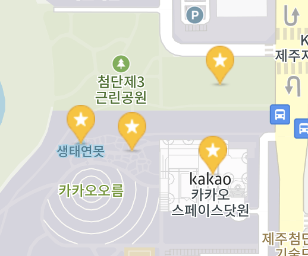

하지만 마커의 갯수가 과도하게 많다면 어떤 전략을 세울 수 있을까요?

### 카페인 팀에서는요 ...


카페인 서비스에서 지도는 굉장히 중요한 요소 중 하나였습니다. 사용자들이 궁금한 장소의 주변에 있는 충전소를 시각적으로 제공해주기 위해서는 지도를 잘 제어할 수 있어야 했습니다. 특히 전국에 이미 `수십만 대의 충전소`가 보급이 된 상황에서 충전소 마커를 모두 그려주기 위해서는 많은 제약이 있었고, 마커를 적당한 수준으로 렌더링 하려면 클라이언트와 서버 간에 특별한 작업이 필요했습니다.

어떤 전략을 펼쳤는지 소개하기에 앞서 미리 말씀드리지만, 저희 팀에서 취한 지도 관리 전략은 모든 프로젝트에 유효하지 않을 것입니다. 지도 위에 한번에 표현할 마커의 갯수가 수백 개 이하라면, 서버에 데이터가 과도하게 많은 것이 아니라면 오히려 이러한 전략이 사용자 경험을 해칠 수 있을 것입니다. (환경이 원활하다면 데이터를 가능한 많이 보여주는 것이 좋을테니깐요.)

또, 이 글에서는 Google Maps API를 기준으로 설명하고 있지만, 지원하는 기능이 일부 다르더라도 대부분의 지도 API에서 사용이 가능한 전략일 것입니다. 참고로 개인적으로 사용 해본 여러 벤더 사의 지도 API들은 모두 이와 유사한 기능을 제공했습니다.


### 좌표란 무엇일까?

아마 어린 시절부터 우리나라에는 특별히 38선이라는 것이 존재한다는 사실을 교육받기에 `좌표계라는 것이 있다는 사실`은 누구나 알 것입니다. 하지만 당장 위도와 경도를 구분지으라고 하면 어떤 선이 위선이고 경선인지 헷갈리기에 찍어야 할 것입니다. 따라서 이 선이 어떤 선인지, 어떤 값을 얘기하려는 것인지 사진과 함께 간단히 설명하겠습니다.

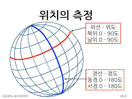

사진을 보시면 아시겠지만 위도란, 남북의 위치를 나타내는 데 사용됩니다. 경도는 동서의 위치를 나타내는 데 사용됩니다. 대부분의 공식 문서가 영어로 작성되어있고, 코드에서도 이를 나타내는 것이 중요하기에 영문 표기법까지 소개를 하자면 위도는 Latitude, 경도는 Longitude로 표기합니다. 이유는 모르겠지만 제공되는 변수나 메서드 명으로 lat, lng라고 줄여서 표기하기도 합니다.

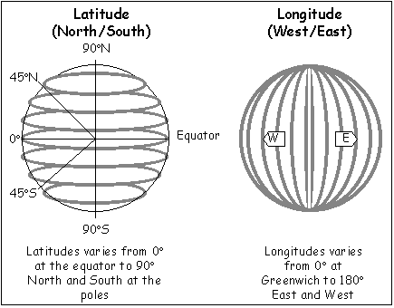

위도와 경도만 알면, 지구 위의 어떤 위치를 나타낼 수 있습니다.

따라서, 어떤 마커를 어떤 위치에 찍을 것인지는 위도와 경도 값으로 결정할 수 있게 되겠죠?

### 사용자가 어딜 보고 있을까?

지도 api에서 제공해주는 메서드를 활용하면 사용자의 디바이스가 어느 위치를 보고 있는지 알 수 있습니다.

```typescript
let map = /* 어디선가 생성된 구글 맵 객체 */
const center = map.getCenter();
console.log(center.lng()); // 디바이스 중심의 longitude
console.log(center.lat()); // 디바이스 중심의 latitude
```

지도 객체로 부터 중심점을 알게되면 해당 디바이스의 중심의 좌표를 알아낼 수 있게 됩니다.

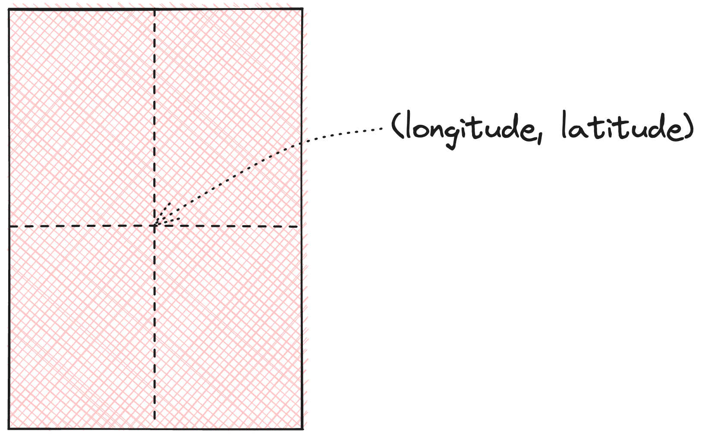

### 사용자의 디바이스는 얼마나 넓게 보고 있을까?

지도 api에서 제공해주는 메서드를 활용하면 사용자의 디바이스가 어떤 영역을 보고 있는지도 알게 됩니다. 지도 api 마다 제공하는 스펙이 다르지만, 대부분은 어떤 식으로든 알려줍니다.

google maps API에서는 디스플레이의 북동쪽 끝 점의 좌표와, 남서쪽 끝 점의 좌표를 제공해줍니다.

```typescript
const map = /* 어디선가 생성된 구글 맵 객체 */
const bounds = map.getBounds();
console.log(bounds.getNorthEast().lng(), bounds.getNorthEast().lat()); // 디바이스 1사분면 끝 점의 longitude와 latitude
console.log(bounds.getSouthWest().lng(), bounds.getSouthWest().lat()); // 디바이스 3사분면 끝 점의 longitude와 latitude
```

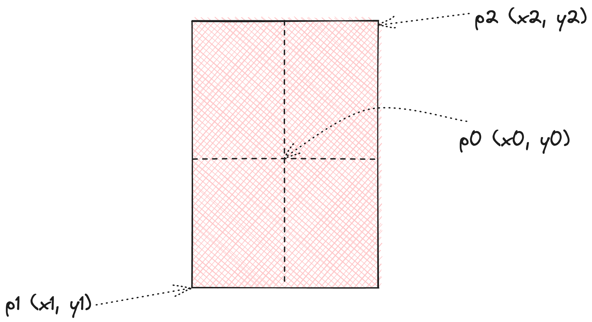

편의상 좌표를 다음과 같이 정의해보겠습니다.

- 중심 점 p0: (x0, y0)
- 디바이스의 제 1사분면 끝점 p2: (x2, y2)
- 디바이스의 제 3사분면 끝점 p1: (x1, y1)

```
위 정의는 아래에서도 계속 설명 될 점과 좌표 입니다.
```

이렇게 알아낸 값으로 사용자 디바이스의 영역을 알게 됐습니다.

저희 카페인 팀에서는 이 값을 좀 더 효율적으로 다루기 위해 delta 개념을 도입했습니다.

### 화면에서 보고 있는 영역을 확대/축소 하면 어떤 특징을 보일까?

delta 설명을 앞서, 사용자의 디바이스 영역과 확대 수준에 따른 실제 좌표에 대해 알아보려고 합니다.

사용자가 화면을 얼마나 넓게 보고 있는지를 쉽게 알기 위해서는 끝점들의 수치를 계산해줄 필요가 있었습니다.

사진은 사용자가 디바이스를 통해 바라 보고 있는 중심 좌표와 그 끝 점을 의미합니다.

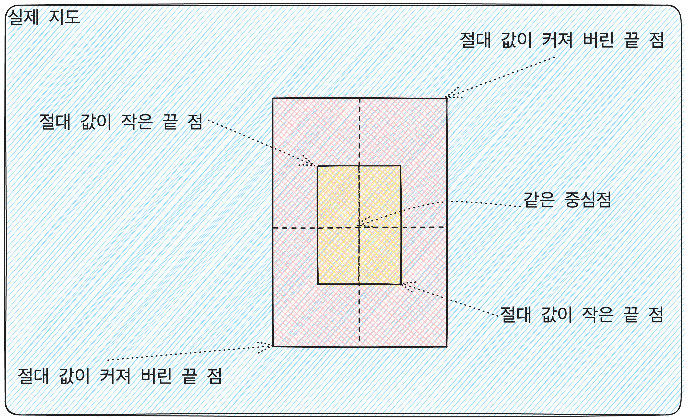


예를 들어 사용자가 지도를 많이 축소한 경우에는 중심 점 p0은 그대로지만 양 끝점 p1, p2의 위치가 점점 중심 점 p0으로 부터 멀어질 것입니다.

반면에 사용자가 지도를 많이 확대한 경우에는 중심 점 p0은 그대로지만 양 끝점 p1, p2의 위치가 점점 중심점과 가까워질 것입니다.

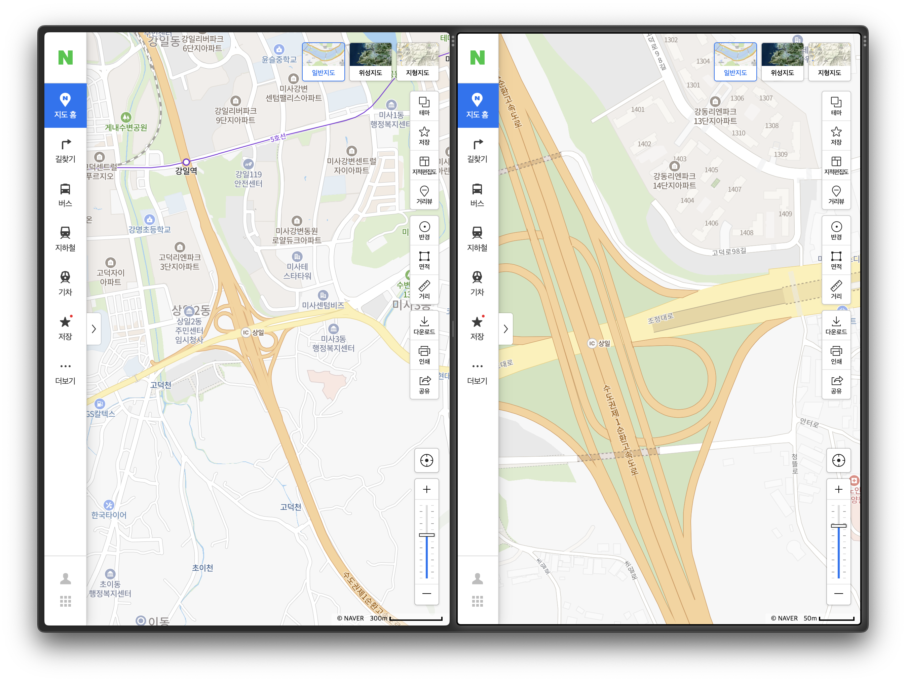

양 사진 모두 중심 점 p0는 그대로지만, 디바이스의 확대 수준으로 인해 양 끝점인 p1과 p2가 달라진 모습을 보인 것입니다.

즉, 이런 결론을 내릴 수 있습니다.

1. 양 끝점 p1, p2가 중심 점 p0으로 부터 멀어질 수록 지도를 축소한 것이다.
2. 양 끝점 p1, p2가 중심 점 p0으로 부터 가까워 수록 지도를 확대한 것이다.

이 때 디바이스의 디스플레이가 위도 경도 상으로 얼마나 멀어져있는지를 수치화하면 편하게 다룰 수 있습니다.

### 확대 수준을 수치화 할 수 없을까?

사용자의 디스플레이의 중심 점 p0을 기준으로 하여 양 끝점 p1, p2이 얼마나 멀어져있는지에 따라 지도의 영역 뿐만 아니라 얼마나 많이 확대 되었는지 여부를 알게 됐습니다.

그렇다면 이를 좀 더 효율적인 방법으로 나타내려면 어떤 전략을 취할 수 있을까요?

사용자 디스플레이를 조금 더 자세히 살펴보겠습니다.

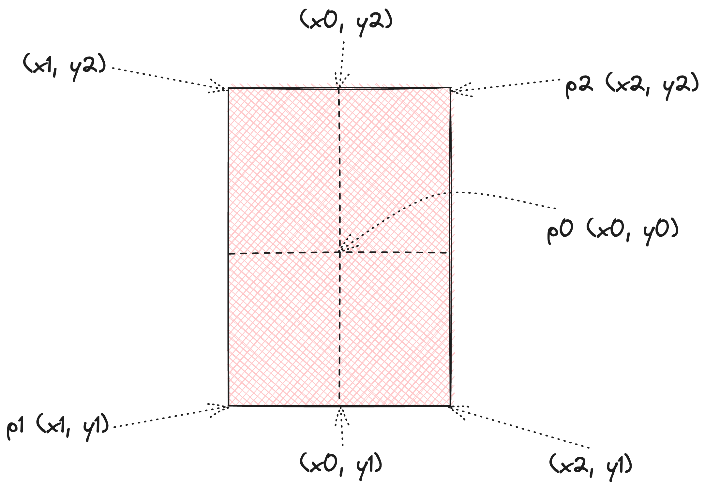

중학교 시절 배웠던 좌표 평면계를 떠올려보면 화면에서 얻을 수 있는 좌표들은 위와 같습니다. 여기에서 각 점의 수직/수평의 변화량인 delta를 알아보면 어떨까요?

#### 경도 델타 (longitudeDelta)

p2와 p0의 경도 거리, 그리고 p1과 p0의 경도 거리는 같습니다.

즉, `x2 - x0 === x0 - x1` 이라는 결론을 얻을 수 있습니다.

이를 longitudeDelta로 정의하겠습니다.

#### 위도 델타 (latitudeDelta)

p2와 p0의 위도 거리, 그리고 p1과 p0의 위도 거리는 같습니다.

즉, `y2 - y0 === y0 - y1` 이라는 결론을 얻을 수 있습니다.

이를 latitudeDelta로 정의하겠습니다.


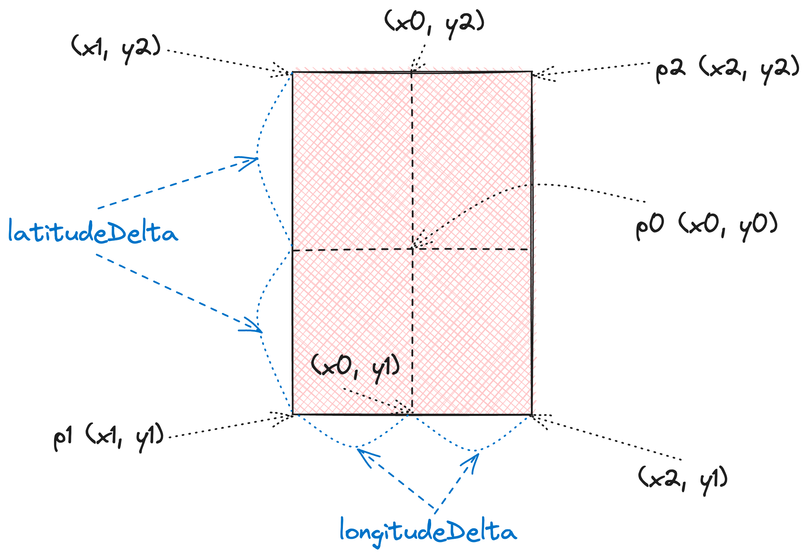

코드로 알아보면 다음과 같습니다.

```typescript
const map = /* 어디선가 생성된 구글 맵 객체 */
const bounds = map.getBounds();
const longitudeDelta = (bounds.getNorthEast().lng() - bounds.getSouthWest().lng()) / 2; // 경도 변화량
const latitudeDelta = (bounds.getNorthEast().lat() - bounds.getSouthWest().lat()) / 2; // 위도 변화량
```

드디어 클라이언트에서 델타 값을 생성할 수 있게 되었습니다.

그렇다면 왜 이렇게 굳이 델타 값을 생성한 것일까요?

### delta의 유용한 점 1: 원래 의도한 값을 복원하기 쉽다.

서버의 입장에서는 중심 좌표와 델타 값만 알면 정확한 영역만큼 데이터를 호출할 수 있게 됩니다.

예를 들어 클라이언트에서 서버로 다음과 같은 파라미터를 넘겨줬다고 가정해보겠습니다.

```json
{
    "longitude": 127,
    "latitude": 37,
    "longitude": 0.1,
    "longitude": 0.2,
}
```

그렇다면 서버에서는 다음과 같이 해석할 수 있게 됩니다.
```javascript
const maxLongitude = longitude + longitudeDelta;
const minLongitude = longitude - longitudeDelta;
const maxLatitude = latitude + latitudeDelta;
const minLatitude = latitude - latitudeDelta;
```
(javascript 기준으로 작성했습니다.)

이렇게 알아낸 경계 값을 가지고 다음과 같은 sql문을 작성할 수 있게 될 것입니다.

```sql
SELECT * FROM stations WHERE latitude >= :minLatitude AND latitude <= :maxLatitude AND longitude >= :minLongitude AND longitude <= :maxLongitude;
```

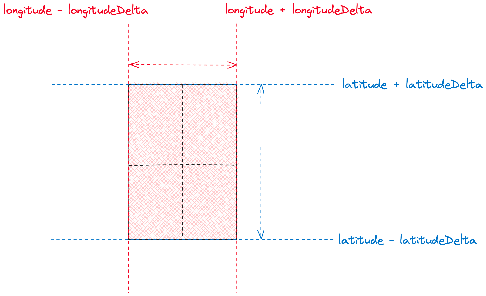

즉, 위 그림처럼, 원하는 영역만큼만 정확하게 데이터를 호출할 수 있게 됩니다.

### delta의 유용한 점 2: 델타가 무분별하게 커지는 것을 막기 쉽다.

예를 들어 사용자가 지도를 축소하여 한반도를 디스플레이에 가득 채운다면 서버가 어떻게 될까요?

이러한 행위를 막는 가장 쉬운 방법은 지도 api에서 지원하는 줌 레벨을 제한 하는 것입니다. 후술하겠지만 _줌 레벨은 디스플레이의 해상도를 고려하지 못합니다._

따라서 근본적으로 델타가 일정 값 이상 요청되지 못하도록, 혹은 연산되지 못하도록 막게 할 수 있습니다.

물론 델타가 없더라도 델타 값을 추정하여 연산할 수 있겠지만, 이를 _수치화 해서 관리한다면 클라이언트와 서버 모두 지도를 손쉽게 통제하는 것이 가능_하게 됩니다.

예를 들어 다음과 같이 델타 값을 고정하여 요청 영역을 제한할(요청을 보내지 않거나 고정된 사이즈로만 요청을 보낼) 수 있습니다.

```json
{
    longitude,
    latitude,
    longitudeDelta: longitudeDelta < 0.008 ? longitudeDelta : 0.008,
    latitudeDelta: latitudeDelta < 0.004 ? latitudeDelta : 0.004,
}
```

특정 수치를 넘기지 못하게 처리할 때 눈에 보이는 변수로 취급하기 쉽습니다. (즉, 매번 계산하지 않아도 됩니다.)

디바이스 크기 관련 문제도 있습니다.

분명히 같은 줌 레벨이지만, 디바이스의 크기나 해상도에 따라 지도가 보여지는 정도가 다릅니다.

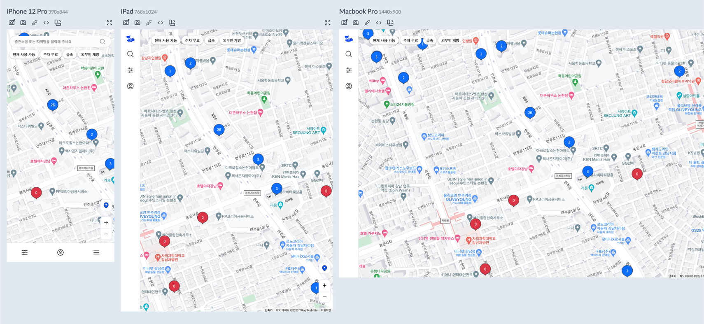

위 사진은 구글에서 제공하는 zoom 레벨을 동일하게 맞춘 후, 여러 디바이스에서 호출한 것입니다.

줌 레벨을 통해서 요청을 제한하다보면 여러 해상도를 제어하기 어렵습니다.

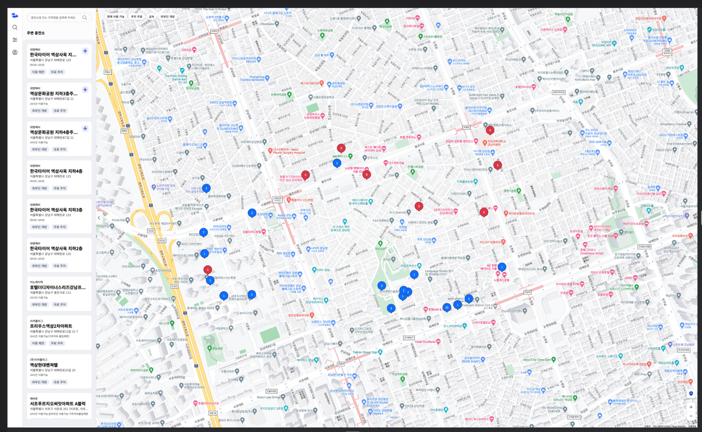

실제로 카페인 팀에서는 고해상도 모니터를 대응하기 위해 델타 값이 너무 크게 되면 요청의 제한을 하고 있습니다. 사진에서 보시다시피 고해상도 모니터의 경우, 너무 넓은 범위를 요청한다 싶으면 중심점으로 부터 일정 거리만 보여주도록 하고 있습니다.

(참고로 줌 레벨에 따른 요청도 덤으로 제한하고 있어서 멀리서 호출하는 행위도 금지하고 있습니다.)

### delta의 유용한 점 3: 적당한 범위를 정해주기 편하다

위 예제에서는 정확한 범위만큼 요청하는 것을 예제로 하지만, 프로젝트에 따라서 조금 더 넓은 영역을 호출하고 싶을 때가 있을 것입니다.

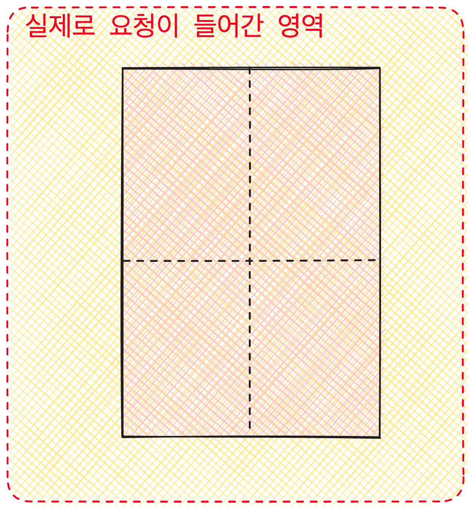

예를 들어 현재 사용자의 디바이스 크기보다 살짝 큰 범위의 데이터를 미리 로드해 놓으면 사용자가 좁은 움직임을 보일 때 불필요한 재 렌더링을 줄여서 더 빠른 렌더링이 가능하게 됩니다.

사실 이 기법은 프로젝트마다 다르겠지만, 카페인 팀에서는 한번 불러온 마커를 매번 해제 하지 않고 **이전 요청 데이터와 다음 요청 데이터를 비교하여 달라진 마커만을 정확하게 탈부착하는 작업을 진행**하고 있습니다.

이런 기법을 활용하면 사용자가 좁은 범위에서 움직임을 보였을 때, 기존에 불러온 마커를 메모리에서 탈락시키지 않으므로 사용자 경험을 개선할 수도 있을 것입니다.

마커를 상태에 연동하여 정확하게 메모리에서 탈부착 시키는 전략에 대한 글은 이후에 작성할 예정입니다.

긴 글 읽어주셔서 감사합니다.
