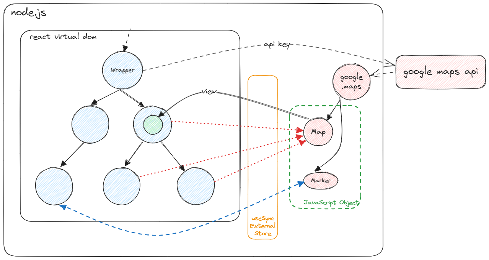
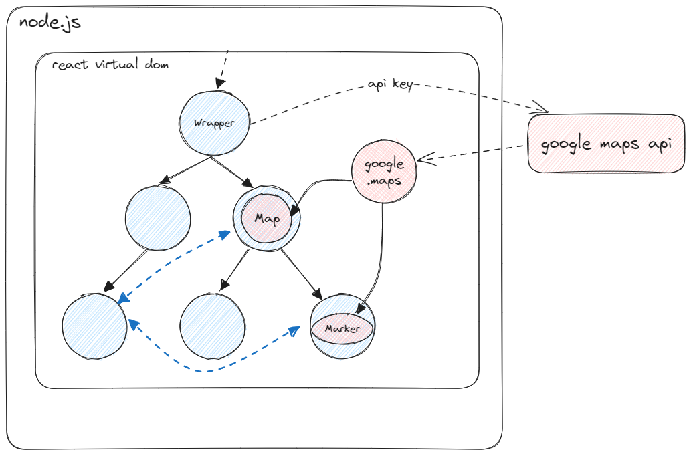
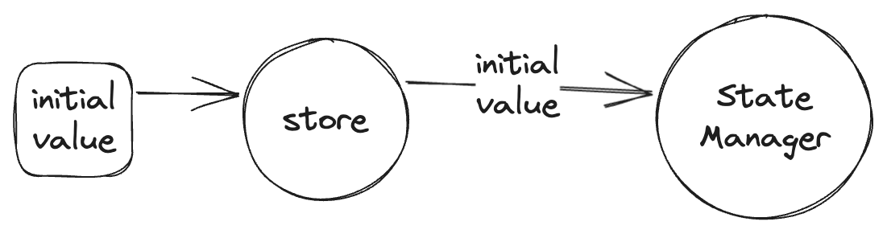
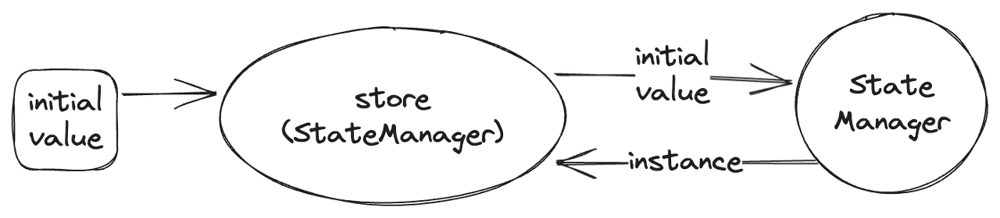
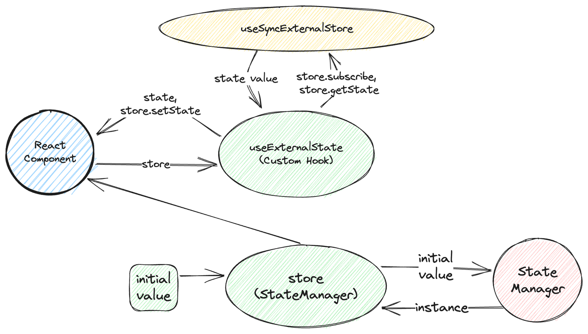

저희 카페인 팀에서는 지도와 React를 결합을 해야했습니다.

프로젝트 초기에는 Google Maps API를 React DOM이 아닌, 바닐라 JS의 영역에서 다루기를 희망하였고, 여러 테스트 결과 두 영역을 분리하는 것은 성공적이었습니다.

React는 그저 부착 당할 DOM을 외부(Google Maps API)로 내어주는 기능에 불과하였고, 지도와 React가 서로 협력 해야할 때만 연락을 하는 구조를 취하고자 했습니다.

예를 들면, React UI는 UI대로 동작하고, 지도는 지도 대로 동작하다가 어느 순간에만 서로가 서로를 조작할 수 있으면 됐습니다.

이를 가능하게 하는 기술로 useSyncExternalStore를 선정하게 됐습니다. 이 훅에 대한 자세한 내용은 [제 블로그](https://leirbag.tistory.com/144)나 [공식문서](https://react.dev/reference/react/useSyncExternalStore)에 나와있으므로 설명을 간략히 하자면 useSyncExternalStore는 React DOM 내부가 아닌 외부 저장소(JS)에서 React DOM을 조작할 수 있도록 하는 커스텀 훅입니다.



이 훅은 React 18에 출시되었으며, 외부 저장소와 React의 소통을 원활하게 돕습니다. 따라서 저희 서비스에서 활용하기 적절하다고 판단했습니다. 이 기능을 어떻게 하면 더 효율적인 방법으로 재사용할 수 있을지 고민하였고, 여러 추상화 단계를 거쳐 라이브러리 수준으로 제작할 수 있게 되었습니다.

하지만 이후에 TanStack Query를 도입하는 과정에서 각종 기능이 React Component 내에서만 사용이 가능하도록 강제되었고, 따라서 더이상 지도 API를 바닐라JS 영역에서 다룰 수 없어 React DOM으로 이식 하게 됐습니다.



이미 만들어 둔 기능이 붕 떠버린 상황이었지만 어찌 됐든 클라이언트 상태에 지도 인스턴스를 넣어야 하는 상황이라 useSyncExternalStore를 프로젝트 끝까지 클라이언트 상태 관리 도구로써 사용하게 됐습니다.

저희 팀에서 사용한 상태 관리 훅의 추상화 과정은 다음과 같습니다.

## **use-external-state 구성 및 동작 원리**

**Store는 상태 관리 인스턴스를 생성한다**

바깥에서 주어진 초기 상태 값은 StateManager라는 클래스에 전달됩니다.



```typescript
export const store = <T>(initialState: T) => {
  const stateManager = new StateManager<T>(initialState);
  return stateManager;
};
```

초기 상태 값을 전달받은 store 함수는 StateManager라는 어떤 상태 관리 인스턴스를 생성합니다.
생성된 StateManager 인스턴스가 반환되어 store가 곧 초기 값을 가지는 StateManager가 됩니다.



예를 들어, 다음과 같은 코드가 있다고 할 때

```typescript
export const countStore = store<number>(0);
```

countStore는 곧 0을 초기값으로 가지는 StateManager 인스턴스이기도 하게 됩니다.

그러면 StateManager에 대해서 알아보겠습니다.

### StateManager는 react 바깥에 있는 어떤 저장소이다.

(근데 이게 그냥 저장소는 아니고 좀 특별한 저장소다.)

```typescript
export type SetStateCallbackType<T> = (prevState: T) => T;

export interface DataObserver<T> {
  setState: (param: SetStateCallbackType<T> | T) => void;
  getState: () => T;
  subscribe: (listener: () => void) => () => void;
  emitChange: () => void;
}

class StateManager<T> implements DataObserver<T> {
  public state: T;
  private listeners: Array<() => void> = [];

  constructor(initialState: T) {
    this.state = initialState;
  }

  setState = (param: SetStateCallbackType<T> | T) => {
    if (param instanceof Function) {
      const newState = param(this.state);
      this.state = newState;
    } else {
      this.state = param;
    }

    this.emitChange();
  };

  getState = () => {
    return this.state;
  };

  subscribe = (listener: () => void) => {
    this.listeners = [...this.listeners, listener];

    return () => {
      this.listeners = this.listeners.filter((l) => l !== listener);
    };
  };

  emitChange = () => {
    for (const listener of this.listeners) {
      listener();
    }
  };
}

export default StateManager;
```

StateManager 클래스는 외부에서 받아온 초기값을 상태로 가집니다.
setState, getState, subscribe, emitChange를 메서드로 가집니다.
여기서 작성된 코드들은 react에서 외부 저장소와 소통하기 위한 [최소한의 규격](https://react.dev/reference/react/useSyncExternalStore#subscribing-to-an-external-store)입니다.

- subscribe: 단일 콜백 인수를 사용하여 스토어에 구독하는 함수입니다. 스토어가 변경되면 제공된 콜백을 호출해야 합니다. 그러면 구성 요소가 다시 렌더링 됩니다. 구독 기능은 구독을 정리하는 기능을 반환해야 합니다. (구독에 관련된 데이터는 리스너 배열 필드에 넣어서 관리합니다.)

- emitChange: 리스너 배열 필드에 담겨있는 모든 리스너를 실행합니다. 즉, 구독된 어떤 것을 순차적으로 실행하게 합니다. 이는 리액트 DOM을 강제로 일깨워주는 옵저버 패턴의 역할을 하게 됩니다. 이 과정 때문에 react DOM이 정확한 재 렌더링 지점을 파악할 수 있게됩니다. (최적화 문제에서 자유로워짐)

- setState: 상태를 업데이트합니다. 다만 상태가 업데이트 됐음을 알려야 하므로 emitChange를 실행시켜 react DOM을 강제로 동기화시킵니다.

- getState: 호출되는 순간 현재 상태 값을 읽습니다.

좀 어렵지만 리액트에서 이런 규격을 가져야 useSyncExternalStore훅을 쓸 수 있게 해 줍니다.
기존 예제에서는 단순한 자바스크립트 객체로 짜여있었지만 인스턴스를 자유롭게 찍어낼 수 있는 class 구조로 개선하고 추상화하였습니다.

사실 여기까지만 구현해도 useSyncExternalStore를 사용하는데 지장이 없습니다.
앞서 선언한 store객체에서 subscribe와 getState를 꺼내서 직접 전달해 주면 그만이기 때문이죠.

하지만 결국 이 과정 자체가 반복된 작업을 요구하게 됩니다.

### 리액트 컴포넌트에서 쉽게 접근하도록 출구를 열어주자!

리액트 컴포넌트에서는 바닐라 JS로 상태를 업데이트하는 것보다는 useState와 비슷한 형태로 훅을 사용하는 것이 훨씬 보기 깔끔할 것입니다.
매번 스토어에서 무언가를 직접 꺼내지 않도록 하는 중간 커스텀 훅이 필요합니다.

```typescript
export const useExternalState = <T>(
  store: DataObserver<T>
): [T, (param: SetStateCallbackType<T> | T) => void] => {
  const { subscribe, getState, setState } = store;
  const state = useSyncExternalStore(subscribe, getState);

  return [state, setState];
};
```

이 훅은, 바깥에서 받아온 store를 활용하여 구독/업데이트 기능을 배열로 반환합니다.
모식도를 그려보면 다음과 같습니다.



React 컴포넌트는 어디선가 생성된 store() 객체를 useExternalStore에 넘겨주고, \[상태, 상태업데이트함수\]를 받게 됩니다.
마치 기존의 useState나 useRecoilState처럼 말이죠.

정리하면 다음과 같습니다.
푸른 영역은 React DOM
녹색 영역은 직접 호출해야 하는 라이브러리의 영역 (하지만 최대한 단순한 형태로 구성해서 개발자의 부담을 덜어주는 형태)
빨간색은 개발자가 직접 건들지 못하지만 간접적으로 사용할 수 있는 영역
노란색은 React 18 엔진의 영역입니다.

이외에 제공되는 다른 커스텀 훅들도 거의 비슷한 구조를 띄고 있습니다.

```typescript
// 추가로 구현할 수 있는 함수들

export const useSetExternalState = <T>(store: DataObserver<T>) => {
  const { setState } = store;

  return setState;
};

export const useExternalValue = <T>(store: DataObserver<T>) => {
  const { subscribe, getState } = store;
  const state = useSyncExternalStore(subscribe, getState);

  return state;
};

// 바닐라JS 영역에서 자연스러운 읽기를 지원하는 함수

export const getStoreSnapshot = <T>(store: DataObserver<T>) => {
  return store.getState();
};
```

더 다양한 예제는 [여기에서 확인](https://github.com/gabrielyoon7/external-state/tree/main/src/examples)할 수 있고
작성한 라이브러리 코드 전문은 [여기에서 확인](https://github.com/gabrielyoon7/external-state/tree/main/src/lib/external-state)할 수 있습니다.

겨우 파일 수십 줄로 만든 초경량 상태관리 라이브러리였습니다
