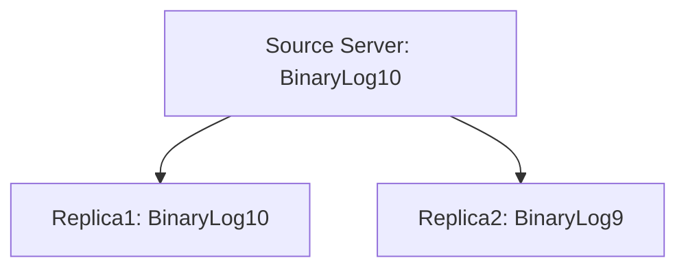
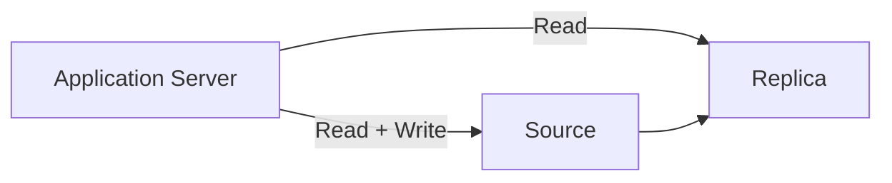
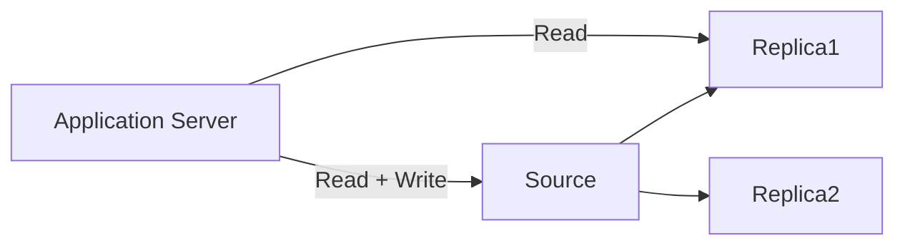
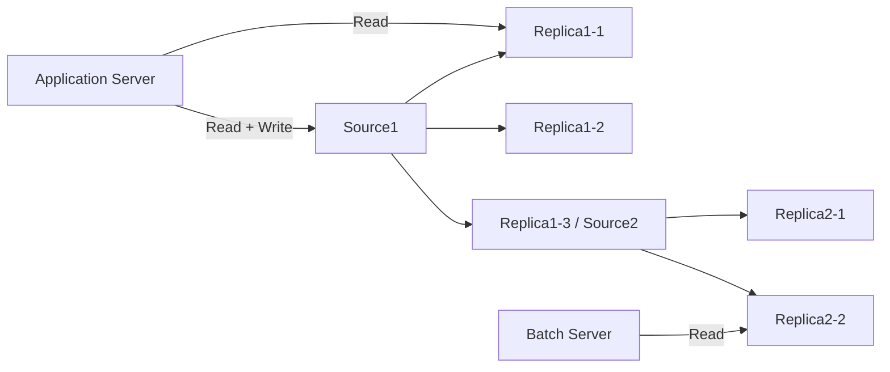
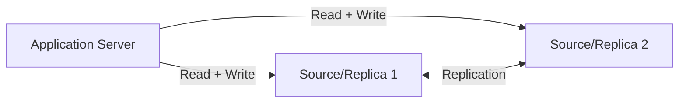
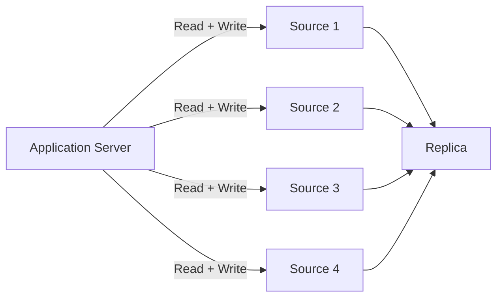

# 이 글을 쓰는 이유

먼저 이 글을 쓰게 된 계기를 말씀드리겠습니다. 지난 글에서 설명했듯이 저희 프로젝트에서는 데이터베이스가 실행되고 있는 서버의 cpu 사용률이 100%가 되는 문제가 있었습니다.
이 부분에 대해서는 조회 성능을 높혀 어느정도 해결하고자 했습니다. 하지만 조회가 아닌 많은 데이터를 일정한 주기로 업데이트 해줘야하는 로직도 포함되어 있기 때문에 업데이트를 할 때 조회를 하게 된다면 cpu 사용률은 비슷할 것입니다. 이 부분을 해결하고자 데이터베이스 레플리케이션을 알아보겠습니다.
결론부터 말씀드리면 데이터베이스 레플리케이션을 적용한 후 성능이 눈에 띄게 좋아졌습니다. 해당 부분은 다음 포스팅에 작성하겠습니다

# 데이터베이스 레플리케이션이란?

데이터베이스 레플리케이션이란 하나의 데이터베이스에서 다른 하나 이상의 데이터베이스로 데이터의 복제 또는 복사를 수행하는 프로세스 또는 기술입니다. 데이터베이스 레플리케이션은 주로 다음과 같은 목적으로 사용됩니다

1. **고가용성**:
데이터베이스 서버의 장애가 발생했을 때, 레플리카 데이터베이스를 사용하여 시스템을 계속 운영할 수 있습니다. 이렇게 하면 서비스 중단 시간을 최소화하고 비즈니스 연속성을 유지할 수 있습니다.

2. **성능 향상** :
레플리케이션을 사용하면 읽기 작업을 분산시킬 수 있으므로 데이터베이스 서버의 읽기 부하를 줄일 수 있습니다. 이를 통해 데이터베이스 성능을 향상시킬 수 있습니다.

3. **지역적 분산** :
데이터베이스 레플리케이션을 통해 데이터를 지리적으로 분산시킬 수 있습니다. 이렇게 하면 지역적인 사용자 또는 응용 프로그램에 빠르게 데이터를 제공할 수 있으며, 지역적인 규정 준수 요구사항을 충족시킬 수 있습니다.

4. **백업과 복구** :
레플리케이션을 사용하여 주 데이터베이스의 백업을 생성하고, 이를 사용하여 장애 복구를 수행할 수 있습니다. 주 데이터베이스가 손상되었을 때 백업 데이터베이스를 사용하여 시스템을 빠르게 복원할 수 있습니다.

5. **데이터 분석 및 보고** :
레플리케이션을 사용하여 데이터를 다른 분석 또는 보고 도구로 복사하여 데이터 웨어하우스 또는 분석 시스템에서 사용할 수 있습니다.

저희 팀에서 레플리케이션을 적용한 가장 큰 이유는 성능 향상입니다. 아무래도 저희 서비스에서는 읽기 작업과 쓰기 작업이 둘 다 빈번하게 일어나고, 특히 쓰기 작업에 많은 연산이 필요합니다. 사용자에게 최신의 데이터를 제공하고자 쓰기 작업을 자주하여 데이터를 최신화하더라도, 읽기 작업이 느려지면 아무도 사용하지 않을 것입니다. 하지만 이렇게 서버를 여러 대 두어 하나의 데이터베이스 서버가 받는 부하를 분산시킨다면 성능이 향상 될 것입니다.

그리고 두번째로는 고가용성입니다. 현재 저희의 데이터베이스는 하나의 서버로 SPOF 문제가 있습니다. 하지만 레플리케이션을 적용하여 데이터베이스를 분산한다면 하나의 데이터베이스가 장애가 생겨 중지가 되더라도, 다른 서버의 데이터베이스로 서비스를 이어나갈 수 있습니다.

# 데이터베이스 복제 방식

데이터베이스 복제 방식은 크게 두가지가 있습니다. **Binary Log로 복제하는 방식**과 **GTID(Global Transaction Id)를 통해 복제를 하는 방식**이 있습니다.

## Binary log 복제 방식
먼저 Binary Log 는 데이터베이스에서 수행한 쿼리 (사용자 추가, 인덱스 추가, Update, Insert, Delete 등 ) 모든 정보를 Binary Log에 기록합니다. 그리고 해당 바이너리 로그에는 이벤트마다 Mysql 서버의 고유한 Server id를 가지고 있는데, 해당 Id가 같은 서버에서는 해당 이벤트를 자신이 발생시킨 이벤트로 간주하고 적용하지 않습니다. 그러므로 각각의 고유한 server id를 설정해줘야 합니다.
이 **바이너리 로그 파일의 위치와 바이너리 로그 파일명**을 통해 Replica 서버는 Source 서버의 이벤트를 적용합니다
## GTID 복제 방식
Mysql 5.5 버전 이상부터는 GTID 기반 복제도 가능하게 추가되었습니다 GTID는 source id와 transaction id가 조합된 방식으로 생성됩니다. source id는 트랜잭션이 발생한 소스 서버를 식별하기 위한 값으로 server의 uuid 입니다.
```sql
+--------------------------------------+
| source_uuid                          |
+--------------------------------------+
| c3a2296b-31a2-11ee-b887-02a8cf0173ac |
+--------------------------------------+
```
이러한 GTID를 기반으로 Source 서버를 구분하고 Binary Log 파일에 기록된 GTID를 확인하여 마지막에 적용한 이벤트를 확인하고, 적용하지 않은 이벤트를 순차대로 실행시켜 복제할 수 있습니다.

이 두가지 방법 중 저희는 GTID 방식의 복제를 선택했습니다. 이유는 간단합니다.

이런 방식으로 토폴로지를 구성했다고 가정해보겠습니다. Source 서버에서는 Binary Log 10번 파일까지 이벤트가 발생했습니다. 그리고 Replica1 에서는 Source 서버의 이벤트가 최신화 되어 있지만, Replica2  서버는 아직 최신화가 되지 않은 상황입니다. 이 상황에서 Source Server에 장애가 발생하여 서버가 중단 되었습니다.

그러면 Replica1 서버를 Source 서버로 승격합니다. 이렇게 된다면 Replica1 서버에서 모든 쿼리의 요청이 들어오게 됩니다. BinaryLog10이라는 파일의 위치와 파일을 찾을 방법이 없기 때문에 Source서버가 복구되지 않는 이상 혹은 Replica 1 서버의 Relay Log가 남아있지 않는 이상 Replica2 서버는 절대 최신화될 수 없습니다. 이런 식의 방식이라면 Source 서버가 중단되었을 때 다른 서버가 동작하기 때문에 고가용성 문제는 해결된 것 같지만, Replica2 서버는 아무 일도 하지않고 남아있는 서버, 즉 Source 서버 하나가 중단되었으나 **2대의 서버가 중단된 것**과 마찬가지입니다.

이러한 문제를 해결하기 위해 GTID가 등장했습니다. GTID 방식은 Binary Log의 위치와 파일명이 필요한 것이 아닌 다음 이벤트의 GTID만 있다면 해당 이벤트를 바로 적용할 수 있다는 점입니다. Source 서버로 승격된 Replica1 서버에서 **GTID를 받아 적용하여 최신화**할 수 있습니다.

### 저희 팀의 복제 방식
이러한 장점으로 GTID기반 복제 방식을 사용하였습니다.

# 복제 동기화 방식

복제 방식에는 크게 두가지가 있습니다. **비동기 복제**와 **반동기 복제**입니다.

## 비동기 복제
비동기 복제는 말그대로 비동기로 복제하는 것입니다. 아주 간단합니다. Source 서버에서 어떠한 이벤트가 발생할 때 Replica 서버의 반영과 상관없이 동작하는 것입니다.
소스 서버에서 커밋된 트랜잭션은 바이너리 로그에 기록되고, 레플리카 서버에서는 주기적으로 새로운 트랜잭션에 대한 바이너리 로그를 요청합니다. 이러한 방식은 소스 서버는 레플리카 서버가 제대로 변경 되었는지 알 수 없습니다. 즉 데이터 정합성에 문제가 생긴다는 단점이 있습니다. 하지만 이러한 방식은 소스 서버가 각 트랜잭션에 대해 레플리카 서버로 전송되는 부분을 고려하지 않는다는 점이 속도 측면에서 빠르고, 또 여러 대의 레플리카 서버를 구성하더라도 큰 성능 저하가 없다는 점이서 장점이 있습니다.

## 반동기 복제
반동기 복제는 비동기 복제보다 좀 더 데이터 정합성이 올라갑니다. 소스 서버는 변경된 트랜잭션이 있을 때 레플리카 서버가 다 전송이 되었다는 ACK 신호를 받기 때문에 확실히 알 수 있습니다. 하지만 전송여부만 확인하기 때문에 트랜잭션이 반영이 되었다는 보장은 없습니다. 반동기 복제 방식은 2가지가 있습니다.

1. **After sync**: After Sync 방식은 소스 서버에서 트랜잭션을 바이너리 로그에 기록 후 Storage Engine에 바로 커밋하지 않습니다. 먼저 바이너리 로그에 기록 후 레플리카 서버의 ACK 응답을 기다립니다. 그리고 ACK 응답이 도착하면 그제서야 스토리지 엔진을 커밋하여 트랜잭션을 처리하고 결과를 반환합니다.
2. **After commit**: After commit은 이름 그대로 커밋을 먼저 하는 것입니다. 트랜잭션이 생기면 먼저 바이너리 로그에 기록 후 소스 서버 스토리지 엔진에 커밋합니다. 그리고 레플리카 서버의 ACK 응답이 내려오면 클라이언트는 처리 결과를 얻고 다음 쿼리를 수행할 수 있습니다.

먼저 after commit 방식은 소스 서버에 장애가 발생했을 때 팬텀 리드가 발생하게 됩니다. 트랜잭션이 스토리지 엔진 커밋까지된 후 레플리카 서버의 응답을 기다립니다. 이처럼 스토리지 엔진 커밋까지 완료된 데이터는 다른 세션에서도 조회가 가능합니다. 트랜잭션이 커밋되었고, 레플리카 서버로 아직 응답을 기다릴 때, 소스 서버에 장애가 발생한다면 새로운 소스 서버로 승격된 레플리카 서버에서 데이터를 조회할 때 자신이 이전 소스 서버에서 조회했던 데이터를 보지 못할 수도 있습니다.

그리고 이처럼 레플리카 서버가 승격된 상황에 소스 서버의 장애가 복구되어 재사용할 경우 이미 커밋된 그 트랜잭션을 수동으로 롤백 시켜야만 데이터가 맞는 상황이 생깁니다.

### 저희 팀의 복제 동기화 방식
이러한 장단점으로 저희 팀은 데이터 무결성이 중요하다 판단되어 반동기 복제 방식을 사용하고, After Sync 방식을 적용하였습니다.

# 복제 토폴리지

복제 토폴리지는 여러가지 방식 중 자신의 상황과 가장 맞는 방식을 사용하면 될 것 같습니다. 저희 팀이 고려해야할 문제는 먼저 성능을 올려야 했고, 단일 장애포인트를 개선해야했습니다. 하지만 사용할 수 있는 서버는 2대 뿐이였습니다. 이러한 상황에서 어떤 방식을 택할 수 있을까요?

## 싱글 레플리카

가장 기본적이며 가장 많이 쓰이는 형태입니다. 어플리케이션에서 레플리카 서버에 읽기 요청을 전달하면, 레플리카 서버에 문제가 생겼을 때, 서비스 장애 상황이 발생할 수 있습니다. 그러므로 소스 서버에서 Read, Write를 둘 다 하고, 레플리카 서버는 failover를 위해 대기하는 예비용 서버로 구성합니다.
소스 서버에 장애가 발생했을 때 소스 서버를 대체하거나 데이터를 백업하는 용도로 사용합니다.

## 멀티 레플리카


싱글 레플리카와 비슷한 구성이지만 레플리카 서버가 한 대 더 추가된 구성입니다. 해당 방식은 SPOF 문제가 없기 때문에 레플리카 서버 하나를 읽기 전용 서버로 둘 수 있습니다. 읽기 작업을 분산함으로 어플리케이션의 성능을 향상 시킬 수 있습니다. 아까 말했던 장애 상황이 발생하면 예비용 서버인 Replica2 서버를 Source 서버 혹은 Replica1(읽기 전용) 서버로 대체할 수 있습니다.

## 체인 복제


레플리카 서버가 많아져 소스 서버의 바이너리 로그를 읽는 부하가 많아질 때 할 수 있는 구성입니다. 좀 전에 설명드렸던 멀티 레플리카 방식에서 똑같은 구성을 추가한 방식으로 볼 수 있습니다. Source 1 의 정보를 복제한 Replica 1-1, 1-2 서버는 빠르게 데이터가 반영되지만, Source1의 이벤트를 복제한 Source2를 복제한 Replica 2-1, 2-2 서버는 당연히 늦게 반영되기 때문에 해당 그룹은 예비용으로 사용합니다.

## 듀얼 소스 복제


데이터베이스 둘 다 소스 서버이면서 레플리카 서버인 경우입니다. 이 경우는 **Active-Active**구성과 **Active-Passive** 구성으로 나뉩니다

Active-Active는 서버 둘 다 읽기와 쓰기가 가능한 형태입니다. 즉 부하를 분산시키기 위해 서버 모두 읽고 쓰는 작업을 하는 것입니다. 하지만 이러한 방식은 뻔한 단점이 있습니다. 서로의 이벤트가 동기화 되기 전에는 정합성이 깨질 수 있습니다. 또 동시에 같은 데이터에 대해 쓰기 작업을 수행할 때, 하나의 서버에서 쓰기가 완료되었더라도, 다른 하나의 서버에 늦게 끝난 쓰기가 있다면 마지막 트랜잭션인 늦게 끝난 쓰기 작업이 반영되어 예상하지 못한 결과가 나올 수 있습니다.

또 다른 문제로는 Auto Increment를 사용할 때입니다. 새로운 데이터가 동시에 생성될 때 Auto Increment가 중복되는 에러가 발생할 수 있기 때문에 해당 토폴로지에서는 ID를 DB에 의존하지 않는 것이 좋습니다.

Active-Passive 방식은 하나의 서버만 읽기와 쓰기 요청이 되지만, 나머지 서버는 대기하고 있습니다. 두 서버 모두 언제나 쓰기 작업이 가능한 형태이기 때문에 장애 발생 시 빠르게 Faliover할 수 있다는 점이 있습니다.

## 멀티 소스 복제



하나의 레플리카 서버가 다수의 소스 서버를 갖는 구성입니다. 데이터베이스 샤딩을 해뒀는데, 다시 하나의 서버로 통합하고 싶을 때 사용할 수 있습니다. 혹은 서로 다른 데이터를 한 곳에 백업을 할 때도 사용할 수 있습니다.

### 저희 팀의 토폴로지 방식
그럼 이렇게나 많은 구성 중에 저희 팀에서 택할 수 있는 토폴로지 방식은 싱글 레플리카 방식과 듀얼 소스 복제 방식 밖에 없습니다. 왜냐하면 주어진 서버가 2대뿐이기 때문입니다.
하지만 듀얼 소스 방식은 적용하는데 무리가 있는 부분이 있습니다. 일단 저희가 레플리케이션을 적용하려는 가장 큰 이유는 **성능** 이기 때문에 성능이 변하지 않는 듀얼 소스의 Active-Passive 방식은 제외하겠습니다. 그리고 Active-Active 방식은 부하를 분산시킬 수 있다는 장점이 있지만, 단점으로는 Auto Increment를 사용하는데에 위험이 있다는 점과, 데이터의 정합성 문제가 생길 수 있다는 점에서 듀얼 소스 방식은 제외하도록 했습니다.

그럼 싱글 레플리카 방식을 적용할 수 밖에 없는데요. 싱글 레플리카의 방식은 가용성 문제를 해결하기 위해 만들어진 방식이지만, 가용성보다 성능을 더 신경써야하는 상황에서는 싱글 레플리카 토폴로지를 구성하지만 레플리카 서버를 예비용이 아닌 읽기 전용 방식으로 사용하도록 하고, 가용성 부분을 포기하기로 정했습니다.

# 코드에 적용하기
[replication-datasource](https://github.com/kwon37xi/replication-datasource) Github 소스 코드를 참고하시거나, [DB 복제, @Transactional에 따라 요청 분리해보기](https://greeng00se.github.io/db-replication) 글을 참고하여 따라하면 금방하실 수 있습니다!

## 결론
데이터베이스 레플리케이션 생각보다 어렵지 않습니다.

데이터베이스 재밌습니다. 인프라도 재밌습니다.

### 참고
real mysql 책


