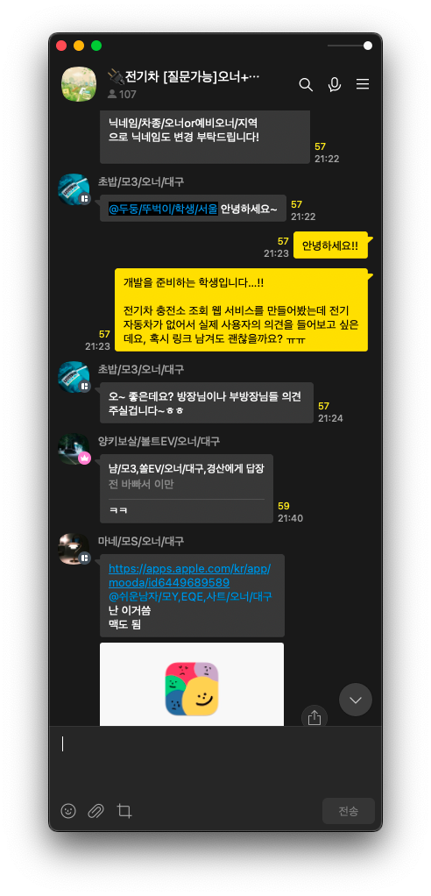

저희 팀은 단순 방문자 100명을 모아야하는 미션을 받았습니다.

목표 달성을 위해 약 2주 전에 실행 계획을 제출해야 했는데요

100명을 모집하기 위해 다음과 같은 계획을 세웠습니다.

---

---

이 당시 저희 팀의 가장 큰 고민은, 전기차가 여전히 소수의 운전자에게만 보급되었다는 점이었습니다.

특히, 전기차 보급 관련 통계 자료를 찾아보면 대부분의 차주들은 40~60대에 압도적으로 몰려있어 젊은 연령 층에서는 거의 구매를 하지 않고 있다는 사실을 알 수 있습니다.

위 자료는 2021년 7월 기준이지만, 최신 자료에서도 마찬가지로 젊은 연령층에서는 전기차를 보유한 사람을 찾기 어렵다고 나옵니다. 실제로 주변 또래의 운전자를 찾아보면 대부분 가솔린 모델을 타고 다니고 있습니다.

따라서 저희는 홍보 대상을 주변에서 찾지 않고 불특정 다수의 사람들을 모집하기 위해 다음과 같은 방법을 사용하기로 했습니다.

# 홍보 방법

## 카페

네이버에 있는 전기자동차 동호회 카페 중 가장 큰 곳에 글을 올려 방문자를 모집하기로 했습니다.

카페에 글을 올리는 것은 무료이며, 카페에 가입한 사람들은 전기차에 관심이 있는 사람들이기 때문에 저희가 원하는 방문자를 모집하기에 적합하다고 생각했습니다.

## 카카오톡 오픈채팅

카카오톡 오픈채팅에는 수많은 대화방이 존재합니다.

특정 주제로 만들어진 대화방이 대부분이기에 전기차를 주제로 한 오픈채팅 대화방을 찾는 것은 전혀 어렵지 않았습니다.

안타깝게도 일부 단톡방에서 강퇴를 당했지만, 차주들과 채팅하면서 피드백을 받아볼 수 있었습니다.

## 기타 홍보 수단

기타 홍보 수단은 아직 사용하지 않았습니다.

네이버 밴드, 보배드림은 사용하는 크루가 없어서 홍보를 하기 어려웠고, 구글 애드센스와 같은 도구는 비용이 발생하기에 아직은 이르다고 판단했습니다.

# Google Analytics 4 통계 집계 결과

## 단순 방문자

이처럼 외부 지역에서도 많이 접속해주신 것을 확인할 수 있습니다.

집계 된 자료처럼 방문자들이 단순 방문만 한 것이 아니라, 수 많은 이벤트를 발생시키고 평균 참여 시간도 상당 부분 확보했음을 확인할 수 있습니다.
