카페인 서비스를 개발하면서 가장 많이 받은 피드백 중 하나는 사용자 경험이 반드시 필요하다는 것이었습니다.

아무래도 전기자동차를 보유한 팀원들이 아무도 없다보니 실제 사용자들이 겪는 어려움을 예상할 수 밖에 없었습니다.

따라서 전기 자동차 운전자들을 찾아내어 인터뷰를 통하여 실제 차주들이 원하는 기능이 무엇인지, 어떤 어려움을 겪는지 수차례 인터뷰를 진행하고 이를 바탕으로 서비스를 개발하였습니다.

서비스를 처음 개발하였을 때 받았던 첫 번째 피드백은 앱 로드 속도가 너무 느리다는 것이었습니다. (실제로 초기 서비스에서는 로딩 속도가 너무 느려서 사용자들에게 서비스 사용을 권장하기 미안한 상태였습니다.)

따라서 실사용자를 모집하는 것 보다 서비스 안정화에 집중이 우선이라는 목표 아래에 서비스를 개선하는 시간을 가졌고, 지금은 로딩 속도가 빠르다는 피드백을 받고 있습니다.

지난 한 달간 서비스 안정화에 집중을 했다면, 이제는 사용자 경험을 개선하는데 집중을 해야할 때가 왔습니다.

따라서 사용자 유치를 위해 전기차 동호회 카페, 카카오톡 오픈채팅, 자동차 커뮤니티 등을 돌면서 홍보를 진행하였습니다.

다행히도 불특정 다수의 익명 사용자들을 손쉽게 구할 수 있었습니다.

사용자들로부터 많은 피드백을 받았고, 해당 피드백을 저희 서비스에 최대한 반영하고자 노력했습니다.

하지만, 이들이 저희 서비스에 단순히 방문하여 피드백을 준 것일 뿐 실제로 사용하면서 피드백을 준 것 같지는 않다는 느낌을 받았습니다.

사용자들이 앱에 머무른 시간을 고려했을 때 3분 이상이라는 긴 시간을 머물러서 앱을 꼼꼼하게 사용했을 것이라고 기대는 하였으나, 사용 중에 피드백을 준다거나 사용 후에 피드백을 준 것이 맞는지 확신하기 어려웠습니다.

그렇다고 주변에서 전기차주들을 찾자니 문제가 발생하였습니다. 일단 전기자동차 보급률이 굉장히 낮았으며, 40~50대에 편중되어 있어 저희에게 협조해 줄 차주분들을 주변에서 찾기 어려웠습니다. (대부분 생업으로 인해 바쁘십니다 ㅠㅠ)

따라서 저희는 그냥 직접 서비스를 경험하면서 사용자 경험을 하기로 하였습니다.

## 카페인 서비스에서는요

저희 서비스에서 지원하는 핵심 기능은 다음과 같았습니다.

- 전국 충전소 조회
  - 지도 탐색을 통한 검색
  - 검색창을 통한 검색
- 충전소의 운영 정보 확인
- 충전소 별 충전기 상태 조회 (실시간)
- 충전소 및 충전기 고장 신고
- 충전소 별 충전기 사용량 통계 조회
- 충전소 별 리뷰 조회

이외에도 많은 기능들이 있었지만, 위의 기능들이 사용자들이 가장 주력으로 사용할 것 같은 기능들이었습니다.

## 계획을 세워보자

전기자동차 렌트에 앞서 어디에 방문할 지 부터 정해야 했습니다.
저희는 몇 가지 원칙을 가지고 방문지를 정하기로 했습니다.

1. 잘 모르는 지역일 것
2. 도착지에 충전소가 반드시 있을 것
3. 타사 앱을 전혀 사용하지 말 것

일단, 제가 처음 정했던 목표는 경상남도 진주시였습니다.
진주시에서 복귀해야하는 팀원이 있던 점, 방문해 본 적이 없는 도시인 점, 장거리라서 충전기 필연적인 점 등 여러 가지 이유로 진주시를 방문하기로 결정했습니다.

카페인 서비스를 킨 순간 눈앞이 캄캄해졌습니다.

"진주시가 어디에 있지?"

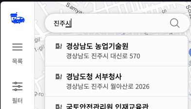

다행히 진주시를 검색하니 주소 기반으로 검색이 되었습니다!
진주시를 검색한 것은 아니지만 간접적이라도 검색이 되는 것을 보고 안심했습니다.
아무 충전소를 눌러서 진주시로 이동하는 것은 가능했습니다.

```
여기에서 저는 이 과정에서 도시나 지역 검색 기능이 반드시 필요하다고 생각했습니다.
```

하지만 너무 멀었습니다.
왕복 700km를 생각해야하여 1박 2일이 필수였고, 팀원들 간에 일정을 조정하기가 너무 어려웠습니다.
따라서 다른 도시를 찾아보기로 했습니다.

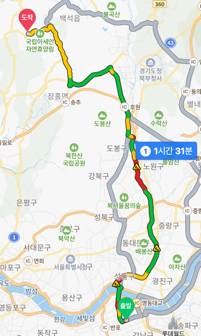

그러던 중, 제가 전에 방문했던 파주시의 `마장호수`가 생각났습니다.
서울에서 꽤나 먼 거리(약 50km)에 있었고, 적당히 시간을 보낼만한 장소였습니다.
다행히도 충전소의 이름이 `마장호수관리사무소`여서 카페인 서비스를 통해 바로 찾을 수 있었습니다.
심지어 마장호수 주변에는 충전소가 많지 않은 편이었고, 초급속 충전기가 있어 저희 앱을 실험하기에 딱 좋았습니다.

## 마장호수로 출발

저 `가브리엘`과 `제이`, `박스터`는 서울 선정릉역에서 아이오닉5를 렌트하고 마장호수로 출발했습니다.

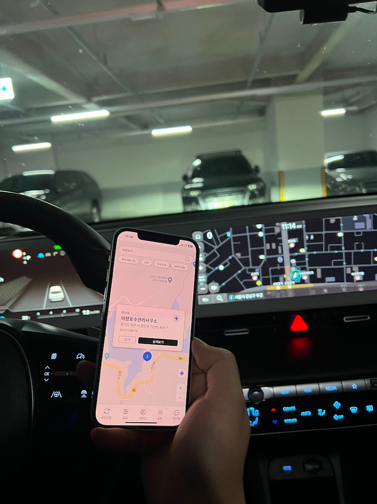

처음 계획했던 것 처럼 타사의 앱을 사용하지 않고 마장호수를 검색하여 이동했습니다.

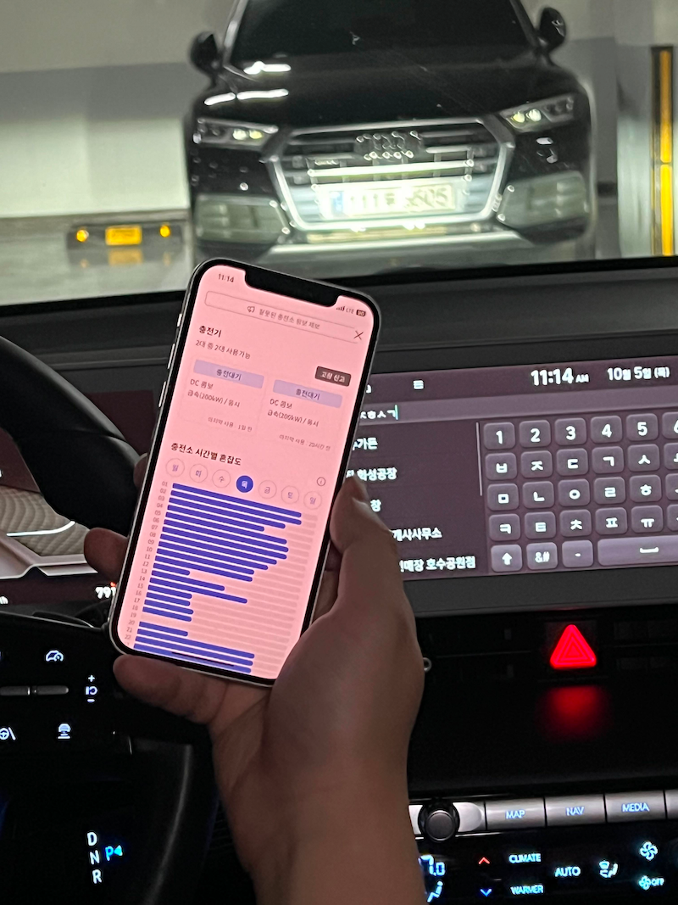

전날 이미 검색을 했지만, 혹시 사용 중일수도 있기에 한번 더 검색해봤으며 해당 시간대에 충전소가 평소에 덜 붐빌 것이라는 통계 자료를 확인했습니다.

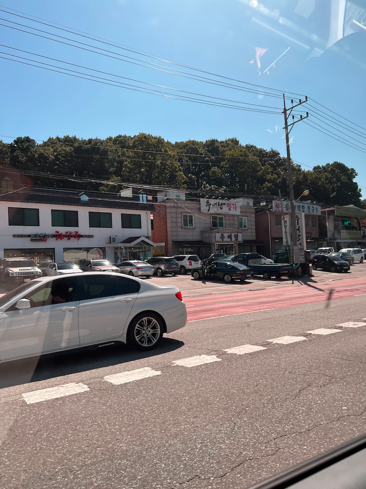

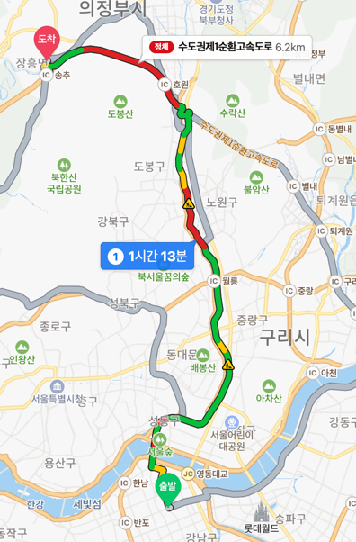

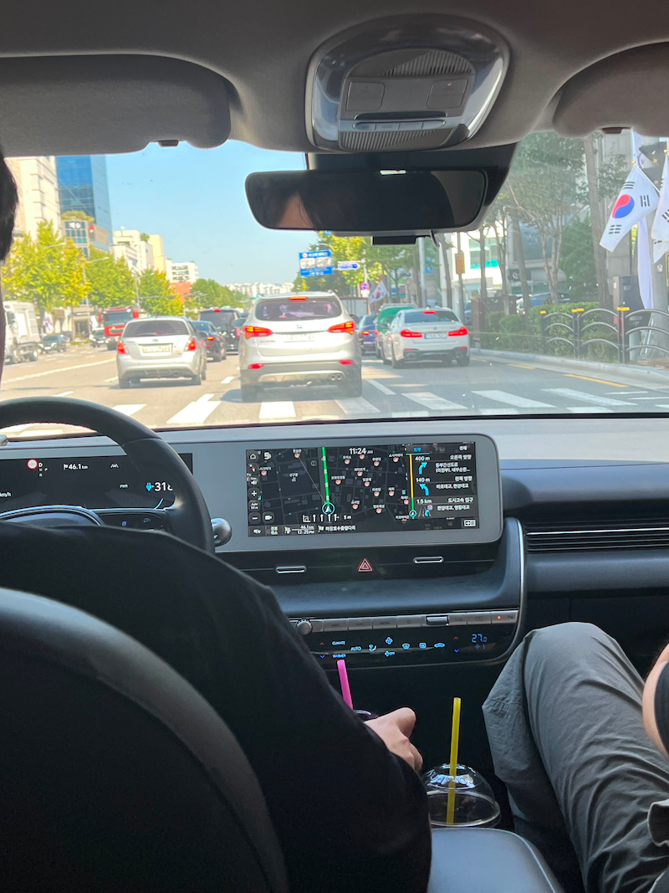

마장 호수까지 20분 거리를 남기고, 갑자기 배가 고파진 저희는 목적지를 틀어 `파주닭국수 본점`을 가기로 했습니다.

## 파주닭국수가 어디에 있지?

카페인 서비스를 활용하여 파주닭국수 본점 근처의 충전소를 검색해보기로 했습니다.
자동차 내비게이션에는 파주닭국수가 어디인지 나와있지만, 저희 서비스에는 식당 정보는 존재하지 않았습니다.
해당 식당이 도대체 어디에 있는지 확인할 수 없었습니다. (파주닭국수에서는 전기차 충전소가 없었기 떄문입니다.)

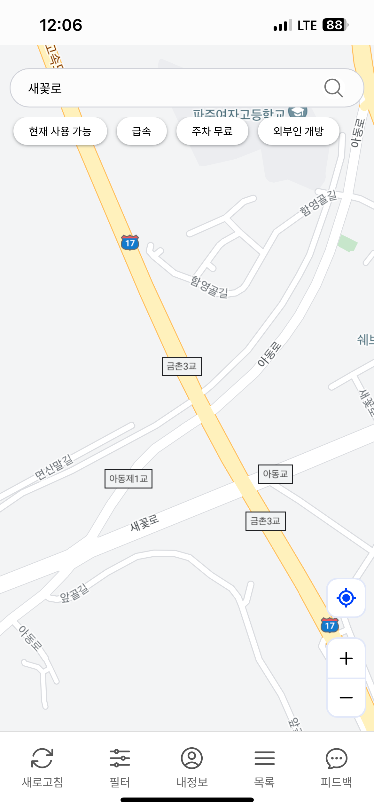

따라서 저희는 자동차 내비게이션에 있는 도로명 주소를 검색하여 위치를 파악하려고 하였고, 다소 부정확 하지만 동네에 있는 인근 충전소를 찾을 수 있었습니다.

## 휴게소에 들리다

카페인 서비스로 검색해보니 식당으로 가는 길 휴게소에도 충전소가 있다고 합니다.
휴게소 이름을 치니 바로 나왔습니다.

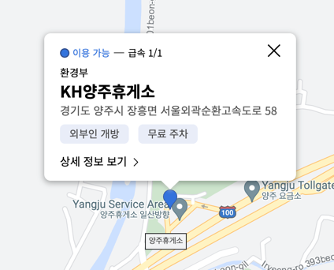

심지어 지금 사용중이라고 합니다! 따라서 저희는 확인해보기 위해 휴게소에 들리기로 했습니다.

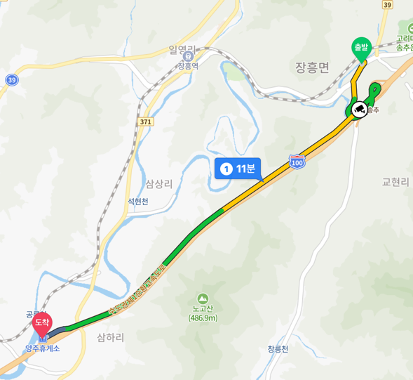
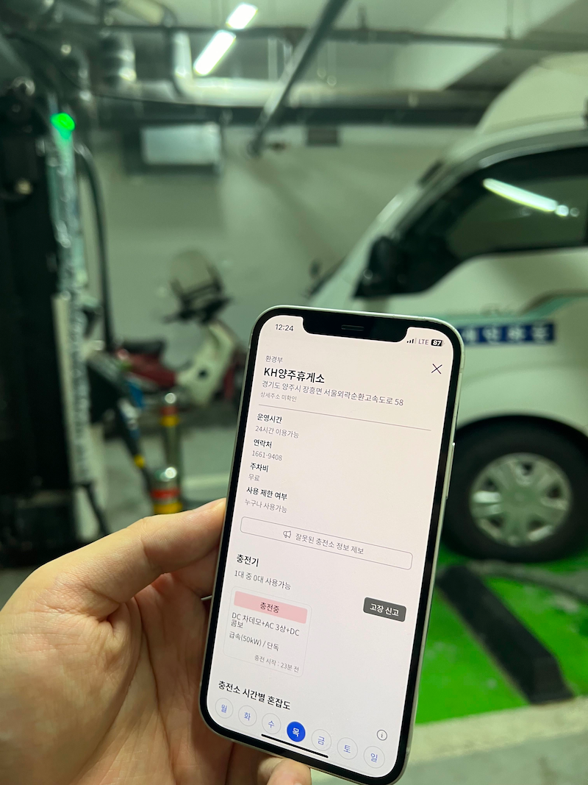

실제로 사용 중임을 확인했습니다. 저희 서비스에서 사용중이라고 나왔는데 실제로 사용중인 것을 보니 공공 api가 나름 실시간으로 데이터를 잘 보내주고 있다고 생각하게 되었고, 저희 팀 서버에서도 이를 제대로 수집하고 있다고 생각하였습니다.

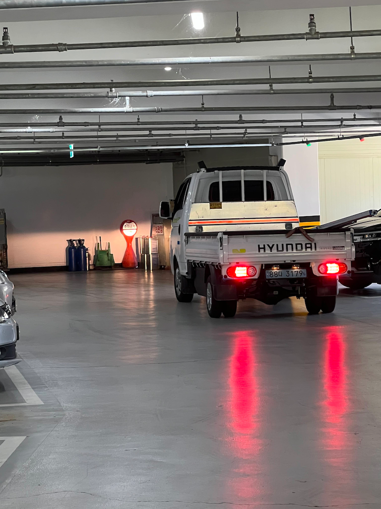

말로만 듣던 고속도로 휴게소의 전기차 충전소 대기줄을 직접 확인할 수 있었습니다.
차주 분과 인터뷰 하고 싶었지만, 차 내부에서 너무 바빠보이셔서 그럴 수 없었습니다.

전기차 충전을 기다리면서 무엇을 할 수 있을까요?
이 분은 다행히도 업무를 보고 계셨지만, 다른 차주들은 무엇을 하고 보낼지 궁금해졌습니다.

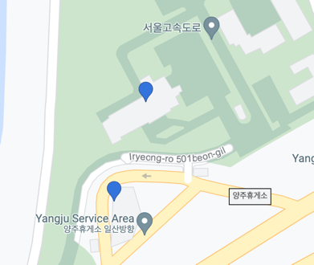

휴게소에는 충전소가 하나 더 있었습니다.

한 곳은 사용중이지만, 다른 한 곳은 사용할 수 있었습니다.

저희는 이 충전소를 사용해보기로 했습니다.

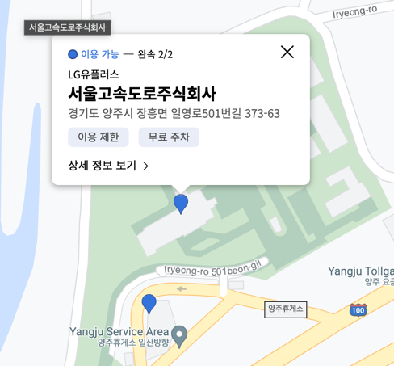

사용할 수 있으니깐 들어가봐야지! 하고 도착한 순간 아차 싶었습니다.

"아, 충전소가 외부인 사용 금지일 수 있었지?"

저희는 분명히 서비스를 직접 개발했으니깐 다 알고 있던 사항이었지만, 전혀 생각치 못했습니다.

서비스를 개발하는 내내 외부인 개방 충전소에 대한 중요성을 간파하였고, 이 기능을 넣었으면서도 사용하지 않고 충전소를 방문한 것이었습니다.

바로 앞에 있어서 다행이었지만, 어찌됐든 이 충전소를 사용할 수 없었습니다.


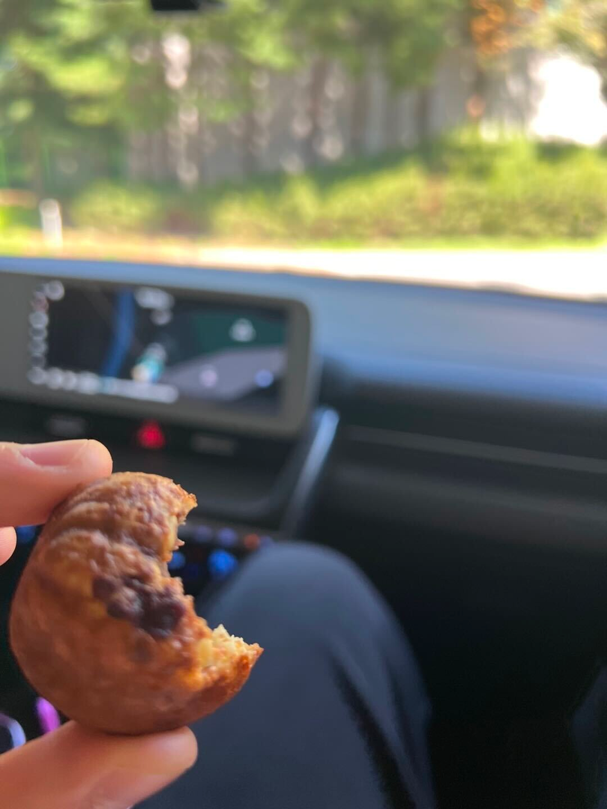


따라서 저희는 휴게소를 떠나는 내내 이 문제에 대해서 토론을 할 수 밖에 없었습니다.

```
분명 우리가 만든 서비스인데 왜 놓쳤을까?
```

## 맛있는 점심

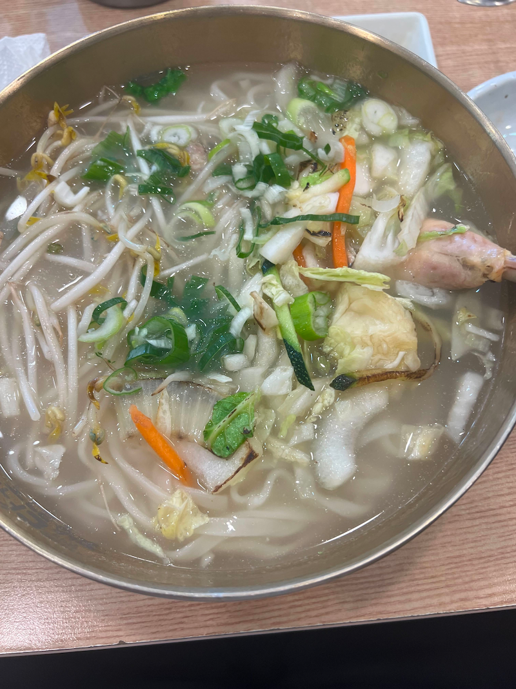

파주닭국수 본점에서 맛있는 식사를 했습니다.

비록 식당에는 전기차 충전소가 없었지만, 인근에 충전소가 있어 실험을 하나 해볼 수 있었습니다.

인근 충전소와 식당의 거리가 가까워 보이는데, 과연 걸어갈 수 있을까?

실제로 걷지는 않았습니다만 차 타면서 지나가면서 확인해본 결과 직접 걸을 수 없는 거리였습니다. (굉장히 걷기 싫은 수준의 먼 거리였습니다.)

집에 있는 PHEV를 탈 기회가 많아 전기차 충전소를 자주 방문했던 저는 이런 점을 잘 알고 있었습니다.

다행히 이 부분을 잘 알고 있었기에 저희는 이 부분을 서비스에 반영하였고, 모든 데이터를 포기하지 않았던 것이 옳은 선택이었다는 것을 확인하게 되었습니다.

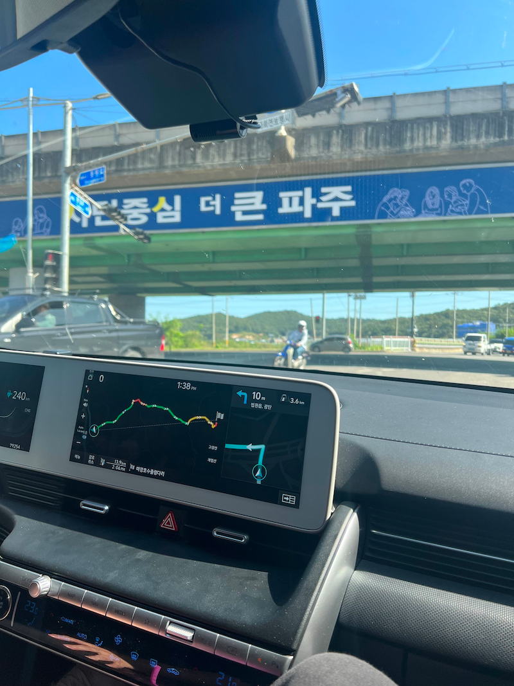

식사가 끝나고 드디어 마장호수로 출발해게 되었습니다.

## 마장호수 도착

마장호수에 도착하자마자 충전소에 방문했습니다.

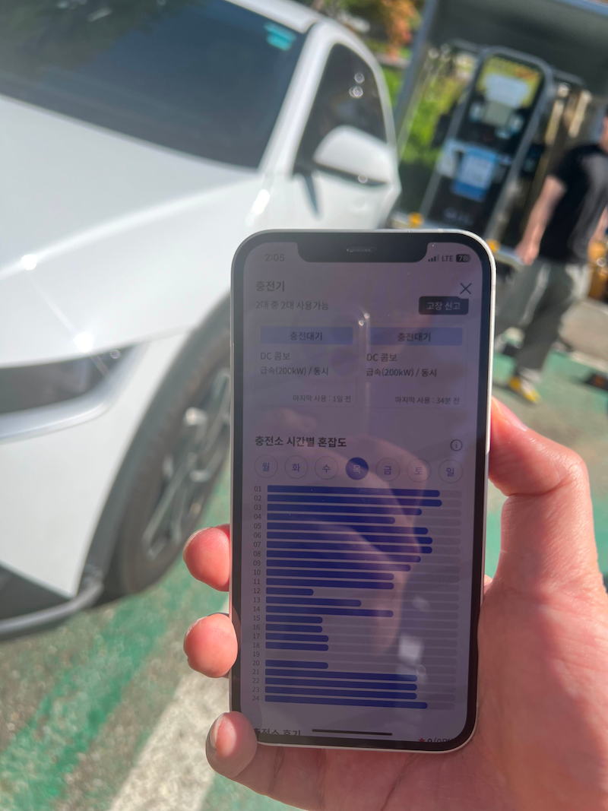

통계에서는 사용률이 적을 것이라고 하였는데 저희만 있었습니다.

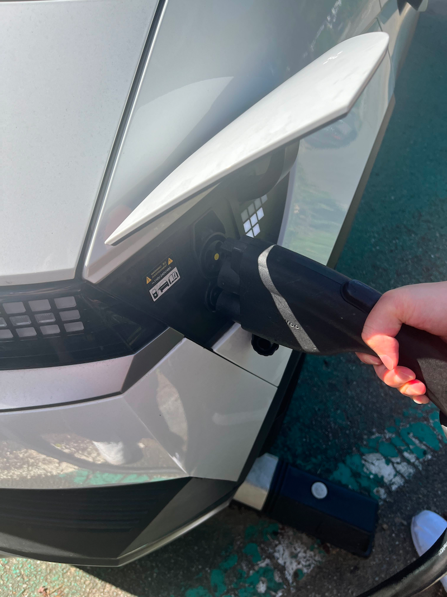
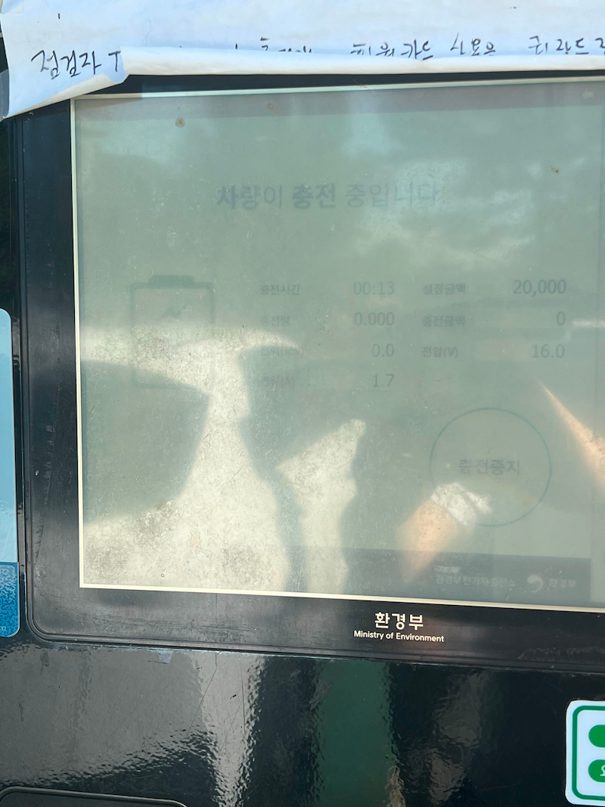

2기 중 1곳을 저희가 사용하였고, 마장호수를 돌았습니다.

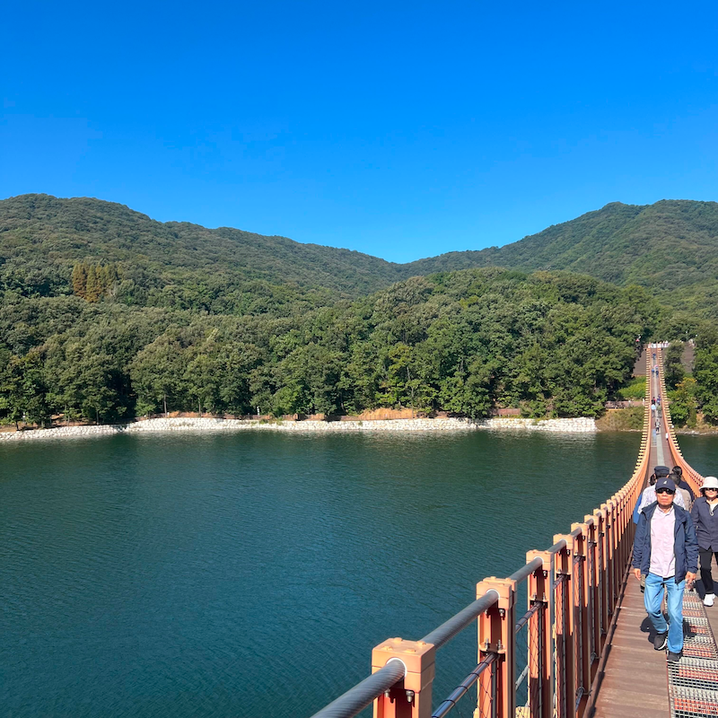

약 50분 간 산책을 하고, 돌아와보니 충전기 다 되어있었습니다.

사실 마장호수 까지 오는 내내 든 생각이었지만, 전기차의 배터리가 생각보다 오래 간다는 생각이 들었습니다.

일부러 회생제동 기능도 끄고, 에어컨을 강하게 틀어서 배터리를 소진하려고 하였으나, 85km를 주행하는 동안 겨우 20%를 소모하였습니다.

충전기를 꽂을 때 50%였으나, 호수를 한바퀴 돌고 오니 이미 100%가 되어있었습니다.

여담이지만, 저희가 돌아왔을 때 옆 자리에는 전기 화물차가 있어 충전소가 가득 찼습니다.

또, 앱에서도 충전기 사용 여부가 업데이트 되는 것을 확인했습니다.

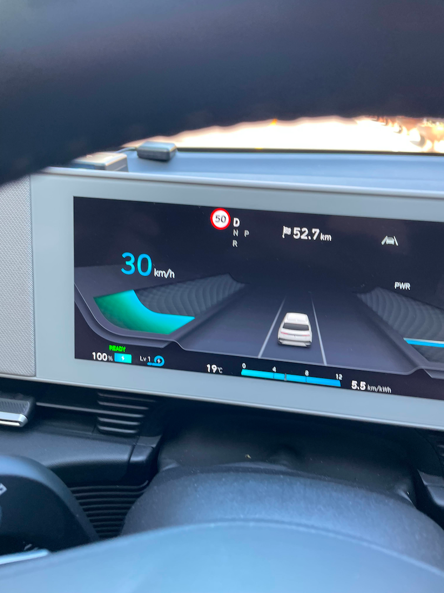

배터리 성능에는 좋지 않고 가격도 비싸서 이를 자주 사용하는 것은 좋지 않겠지만, 급한 사람들은 급속 충전기를 사용하면 되겠구나 싶었습니다.

```
따라서 급속과 완속은 더더욱 다른 개념으로 봐야겠다는 생각이 들었습니다.
```

제가 그동안 경험했던 전기차 충전소는 완속 기준이었기에 신선한 경험이었습니다.

## 선릉으로 돌아오다

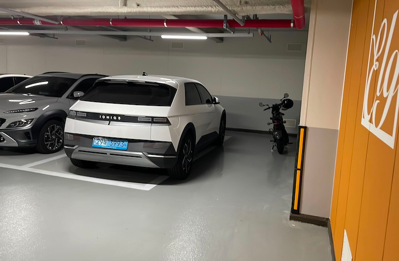

선릉으로 돌아와서 차량을 반납하였습니다.

저희는 이번 여정을 통해 카페인 서비스에서 어떤 점을 개선해야할지 좀 더 명확하게 알게되었습니다.

1. 현재 서비스에서 제공하는 기능들로 충전소를 검색하는 것은 가능하며, 충전소의 위치를 정확하게 파악하는 것도 가능하다.
2. 하지만 충전소가 없는 목적지는 검색할 수 없고, 현 위치가 어디인지 가늠하기가 어려워진다.
3. 충전소를 사용할 수 있다고 표기되어 있더라도 외부인 개방이 아닐 수 있다. 정보가 정확히 제공됨에도 불구하고 이를 단번에 눈치채기 어렵다.
4. 이러한 문제를 예상하여 `외부인 개방 여부`를 필터링 할 수 있는 기능을 제공하고 있음에도 불구하고 사용하지 않았다.
5. 충전소의 통계 자료의 적중률은 높았으나, 좀 더 많은 충전소를 들려 확인해봐야 할 것 같았다.
6. 전기자동차는 생각보다 오래가고 상품성이 있었다. 주행 능력도 충분하고, 인프라가 잘 되어있다. 이걸 왜 욕하지? 라는 생각이 들었다.
7. 지도 확대 허용 범위가 너무 좁아서 사용하는데 불편한건 실제 상황에서 더 불편했다.

이상 카페인 사용기였습니다.
