안녕하세요? 센트와 가브리엘 입니다.

저희 카페인 팀에서는 지난번 [카페인 서비스 1차 체험](https://car-ffeine.github.io/39) 진행 이후 일부 기능 개선이 있었습니다. 기능 개선의 유용성을 판별하고자 카페인 서비스 2차 체험을 다녀왔습니다.

저희 팀에서 1차 체험 이후 개선한 사항은 다음과 같습니다.

### 1. 지역검색

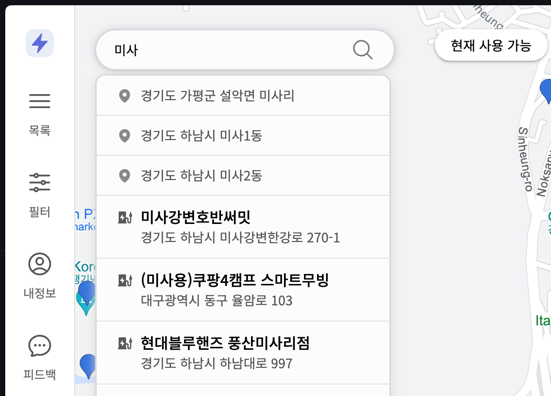

- 이제는 검색어를 입력하는 경우, 전국 도시의 주소가 같이 제공됩니다.

### 2. 충전소 마커를 확인할 수 있는 지도 영역 확장

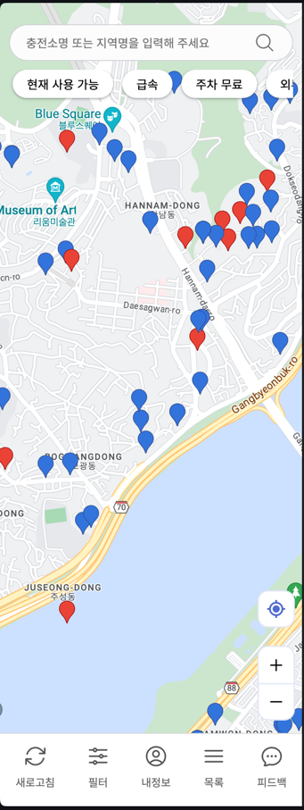

(기존에는 위 사진보다 좁은 영역만을 호출하는 것이 허용되었다.)
- 모바일에서 좀 더 넓은 영역을 호출하는 것을 허용했습니다. 원래는 디바이스 너비를 고려하지 않고 줌 레벨 기준으로 요청을 제한했으나, 이제는 사용자 디바이스에 보이는 지도의 영역 크기를 기반으로 요청을 제한하는 방식을 도입했습니다.
- 기존에 사용하던 마커의 단점은, 그 크기가 너무 크다는 것이었습니다. 이로인해 더 넓은 영역을 보여주는 경우에 마커들이 겹치는 현상이 있었는데요, 이를 수정하기 위해 특정 영역 크기 이상에서는 마커를 좀 더 간소화 된 디자인으로 보이도록 개선하였습니다.
- 마커 사이즈가 작아지면서 사용 가능한 충전기 개수가 더이상 들어갈 공간이 없어졌습니다. 따라서 마커 색상은 그대로 유지를 하되, 인포 윈도우에 현재 사용 가능한 충전기 개수를 보여주는 방식으로 디자인을 개선하였습니다.

## 체험 규칙 설정

개선한 기능이 실제로 유용한지 확인해보기 위해 저희는 카페인 서비스 2차 체험의 규칙을 다음과 같이 설정했습니다.

저희는 좀 더 의미있는 경험을 하기위해 1차 체험 때 정했던 규칙에 더해서 다음과 같은 추가 규칙을 설정하였습니다.

### 중간에 목표 지점이 많이 변경된다

지난 카페인 서비스 1차 체험에서는 지역 검색이 없어 목표 지점을 찾는 것이 불편했습니다. 1차 체험 이후 지역 검색이 추가 되었으므로 이 기능이 얼마나 유용한지 경험해보고자 이 규칙을 설정했습니다.

추가로 목표 지점 주변의 충전소를 확인할 때 새로 추가된 지도 영역 확장이 얼마나 유용한지도 경험해보고자 했습니다.

## 체험 개요

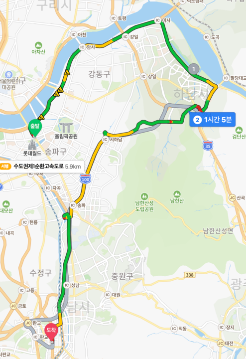
1. 잠실역 출발
2. 하남 만두집
3. 다음 목적지 설정
4. 판교

## 체험 후기

### 잠실역 출발

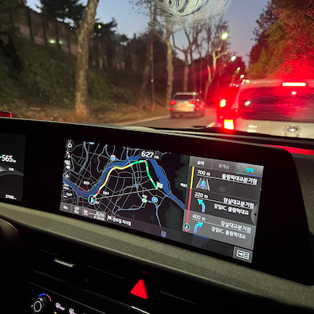

쏘카에서 EV6를 대여해서 `가브리엘`, `센트`, `키아라`가 잠실역에서 출발하였습니다. 저녁 퇴근 이후에 남이섬을 가려고 목적지를 설정하였으나 배가 너무 고파서 가는 길에 식사를 하자고 얘기가 나왔습니다.

### 하남 만두집

따라서 진정한 처음 목적지는 스타필드였으나, 가브리엘은 동네 주민이라 스타필드를 너무 잘 알고 있었습니다. 따라서 스타필드에 전기차 충전소가 어디에 있는지도 알고있으므로 목적지를 급하게 변경하기로 했습니다. 이 때 목적지 변경을 위해 주변 식당을 둘러보던 중에 괜찮은 식당을 발견해서 해당 식당을 기준으로 주변 충전소를 확인해보기로 했습니다.

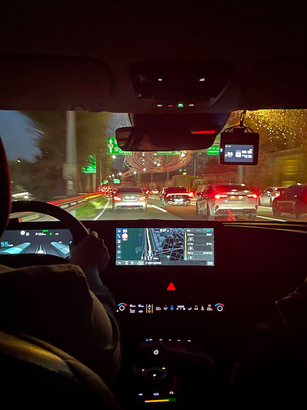

식당 주변을 가기 위해 지역 검색을 처음으로 사용하여 식당과 가까운 지역을 탐색할 수 있었습니다.

이 과정에서 식당에는 충전소가 없다는 사실을 알게되어, 근처 충전소를 찾아보기 위해서 지도를 축소했더니 1차 체험때와는 달리 더 넓은 영역을 보여줬습니다. 이전에는 마커 자체가 보이지 않아 답답하였으나, 이제는 더 넓은 영역을 조회할 수 있게 되어 편리했습니다.

지난 체험 이후로 피드백을 자체 수집하여 개발한 기능들이 편하다는 것을 식당에 가는 길에 느낄 수 있었습니다.

### 다음 목적지 설정

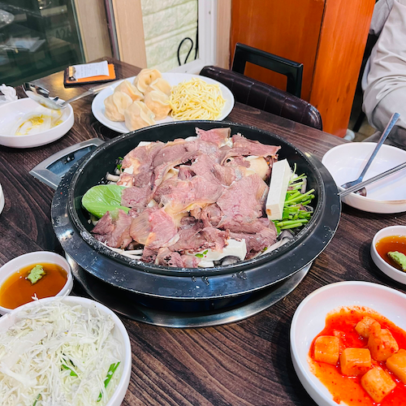

하남 만두집에서 식사를 하다가 알게된 사실은, 남이섬은 생각보다 너무 멀다는 것이었습니다. 식사를 마치고 남이섬에 가면, 충전도 제대로 못하고 돌아올 판이었습니다.

식사를 하면서 다른 목적지를 알아봤는데, 가브리엘이 예전에 가봤던 곳 중에서 남양주의 물의 정원이 시간을 떼우기 좋다는 소리를 하였습니다. 따라서 물의 정원을 검색해보았습니다.

놀랍게도 물의정원은 검색결과에 없었습니다!

어쩔 수 없이 카카오 지도로 물의 정원 위치를 확인하여 주소를 알아내었고, 이 주소를 카페인 검색창에 넣었습니다. 저희는 이 과정에서 카페인 서비스는 업체명 조회가 안된다는 것이 치명적인 단점이라고 생각했습니다. 다만, 이 기능은 검색 할 때마다 많은 비용이 청구되어 현실적으로 지금 당장 기능을 넣는 것은 어렵다고 판단했습니다.

결국 주소 검색을 통해 물의 정원과 가장 가까운 충전소를 알아내었습니다.

그런데! 지도를 축소해서 확인해 보니 해당 충전소는 물의 정원과 생각보다 멀었습니다.

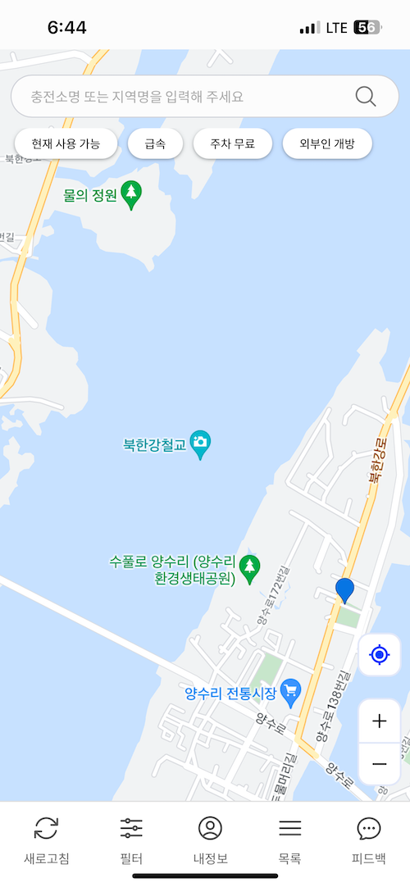

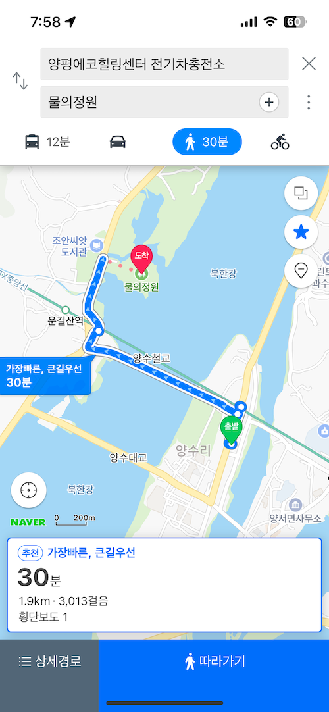

무려 걸어서 30분이나 걸리는 충전소였습니다!

전기차 충전을 위해 왕복 1시간이나 걸리는 거리를 걸을 수 없다고 생각하였습니다.

물론 지난 체험에서 전기차가 생각보다 배터리가 오래간다는 사실을 알고 있었지만, 만약 저희처럼 충전이 급한 사용자라면 목적지를 포기할 수 밖에 없겠구나 라는 생각이 들었습니다.

마지막으로 정한 목적지는, 의외의 결정이었습니다.

굉장히 발전된 첨단 도시로 알려진 판교였습니다!

사실은 앞으로 갈지도 모르는 판교를 미리 구경이나 해보자는게 이유였지만 비밀입니다(?)

일단 판교역은 IT서비스 회사들이 많이 몰려있는 곳이었습니다.

따라서 저희는 판교역을 카페인 검색창에 검색했습니다.

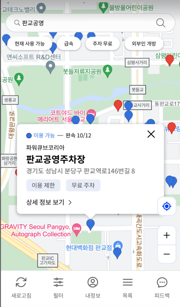

지도를 판교역으로 이동하여 외부인 개방인 충전소를 찾았는데, 판교공영주차장이 보여서 해당 충전소를 목적지로 잡고 출발했습니다.

### 판교

하남에서 판교를 가기 위해서는 서하남IC를 지나야했습니다.

가는 길에 우리 서비스에 나오는 정보와 실제 정보가 일치하는지 점검차 서하남 간이 휴게소를 들려봤습니다.

이 휴게소에도 충전소가 있다고 검색이 되었기 때문입니다!

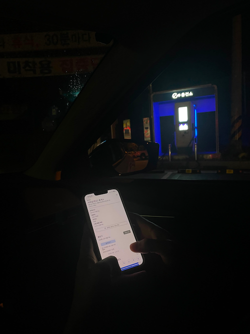

검색 당시에는 2대의 충전기가 있다고 나왔고, 둘다 사용이 가능하다고 되어있었는데 실제로 확인해보니 일치하는 것을 확인했습니다.

먼 길을 달려 판교에 도착하였습니다.

주차장에 들어오기 전, 카페인 서비스를 확인해보니 판교공영주차장의 충전기 총 12기 중 10기가 사용가능한 상태였습니다.

정작 들어와서 보니 입구부터 너무 많은 전기차들이 충전기를 사용중이었습니다.

뭔가 이상하다 싶었지만, 아직 서버에 반영이 안된건가? 하면서 비어있는 충전기를 찾았습니다.

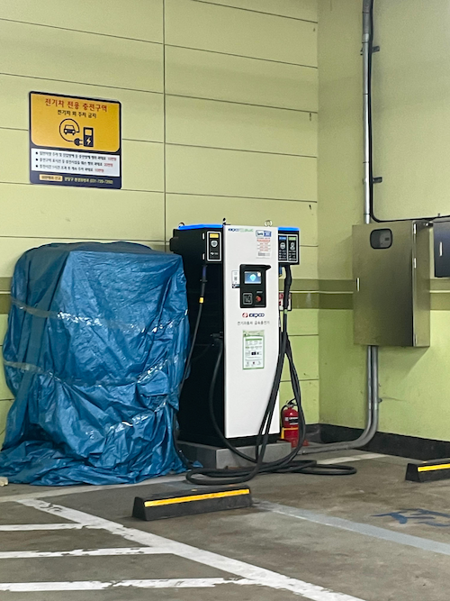
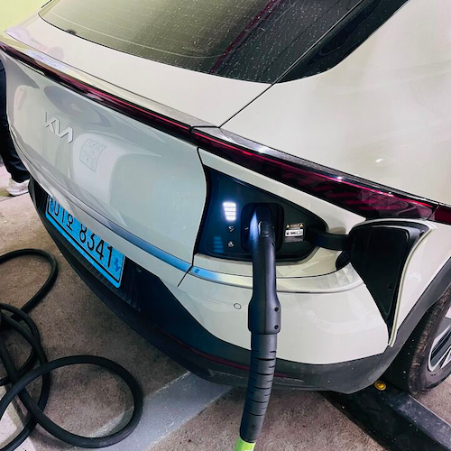

충전기를 꽂고 나서 알게된 것은 카페인 서비스에 나온 충전소 회사명과 방금 꽂은 충전기 회사명이 다르다는 것이었습니다.

알고보니 음성 인식으로 네비에 검색한 충전소는 판교공영주차장이 아닌 판교역 환승 주차장이라 엉뚱한 곳으로 온 것이었습니다!!!

다행인 점은 우리 서비스에서 제공하는 충전기 사용 여부 정보가 잘못된 것이 아니었다는 것이었습니다.

그래서 애초에 가고자 했던 판교공영주자창에 대한 카페인 서비스의 정보가 실제와 동일한지 확인해보러 걸어서 이동했습니다. (바로 앞에 있었기 때문입니다.)

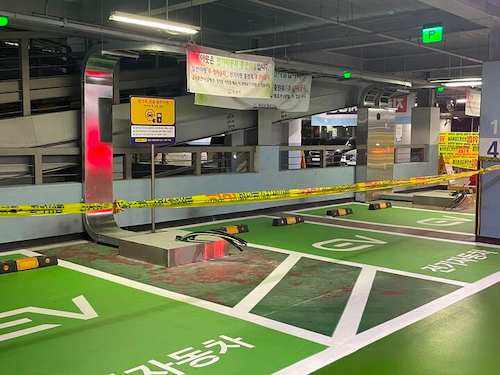
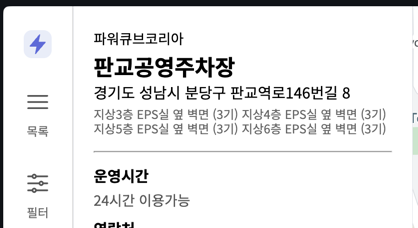

도착해보니 1층의 충전기들이 모두 공사중이었고, 서비스의 정보가 실제로도 불일치 하는 줄 알았습니다. 다시 상세 정보를 보니 3~6층에 충전기들에 대한 정보라는 것이 명시되어 있었고, 실제로도 이와 동일한 것을 확인했습니다.

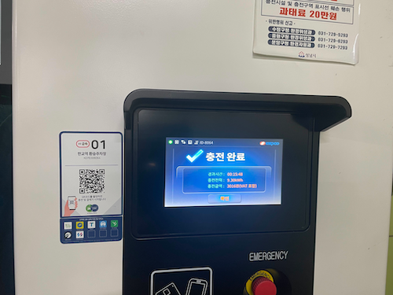

저희는 시간이 너무 흘러 다시 잠실로 돌아와 차를 반납하고 체험을 마무리 했습니다.

## 결론

### 불편했던 점

- 디바이스에 보여지는 지도 영역 확장시에 원하는 정보를 볼 수 없는 것이 불편했다.
  - 지도를 확대해주세요 모달이 뜨고, 원래 있던 충전소 마커가 전부 사라진다.
- 현재 나의 위치를 알아볼 수 있는 수단이 없어 불편했다.
  - 현위치를 나타내는 핀 (1차 체험기에서도 언급했던 부분)
  - 내 위치를 상대적으로 알 수 있는 랜드마크의 부족
- 특정 장소(매장명) 검색이 안돼서 카페인 서비스만으로 목적지를 찾아가기 불편했다.
  - 카카오맵 등을 활용해 특정 장소 검색을 진행해야 했다.

### 다음 목표

앞선 불편했던점을 개선하기 위해 다음과 같은 기능 개선을 추가로 진행할 예정입니다.

- 디바이스에 보여지는 지도 영역 확장에 제한이 생기지 않게 충전소 마커 클러스터링을 우선적으로 도입한다.
- 현재 나의 위치를 알아볼 수 있도록 지하철 역과 같은 랜드마커를 지웠던 것을 롤백한다.

카페인 서비스만으로 목적지를 찾아갈 수 있도록 하기 위해서 특정 장소 검색을 추가하고 싶지만, 해당 기능을 구현하기 위해선 검색당 비용이 많이 청구되는 장소 검색 API를 추가해야 했기에 현실적으로 지금 당장 구현하기 어렵다고 판단했습니다.

이상 카페인 사용기였습니다.
