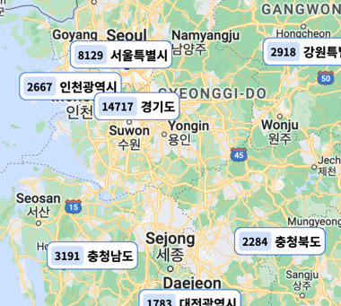
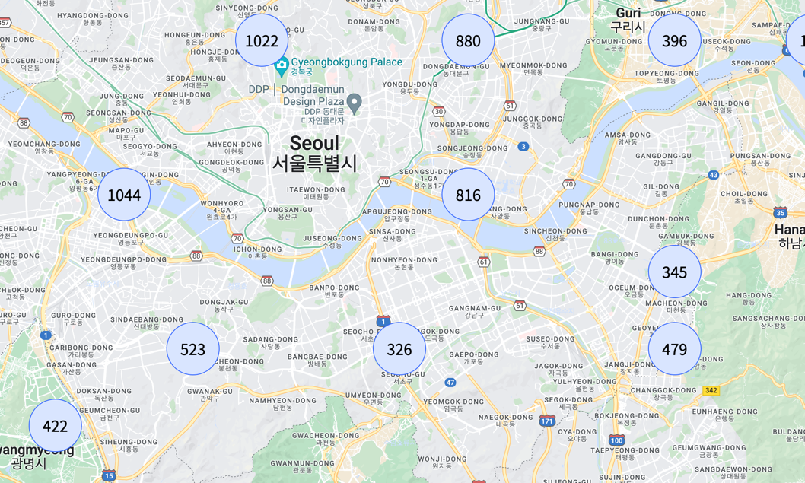
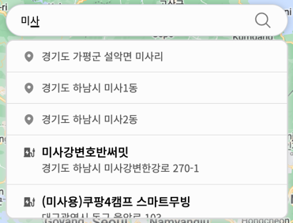
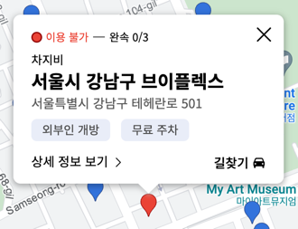
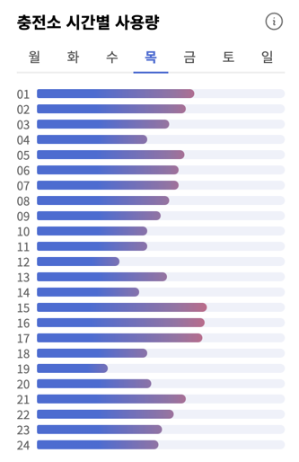
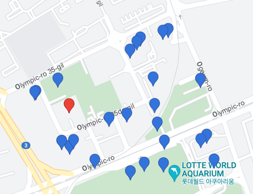
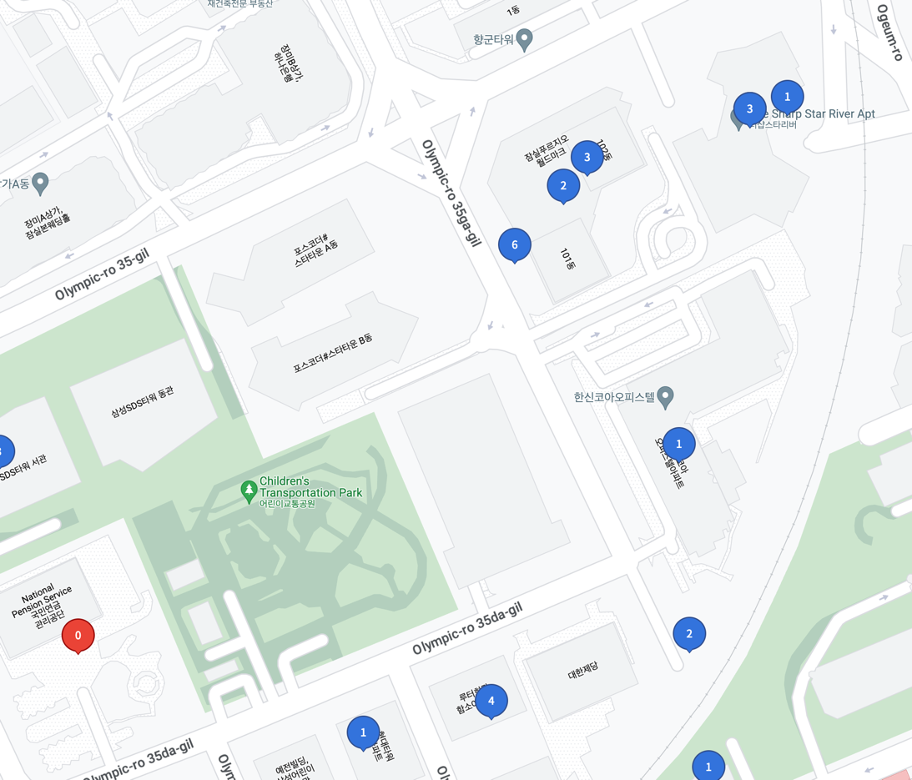

지난 4주 간 변경사항 및 신규 기능을 소개합니다!!

이번 업데이트에는 사용자 경험을 직접 수집하여 피드백을 반영하였답니다!

- [카페인 서비스와 함께하는 전기차 여행 1](https://car-ffeine.github.io/39)
- [카페인 서비스와 함께하는 전기차 여행 2](https://car-ffeine.github.io/40)

## 마커 클러스터링

### 마커 클러스터링이란?

마커 클러스터링은 지도에 표시되는 마커들을 클러스터로 묶어서 표시하는 것을 말합니다. 마커 클러스터링을 사용하면 지도에 표시되는 마커의 수를 줄일 수 있습니다. 마커 클러스터링은 지도에 표시되는 마커의 수가 많을 때 유용하게 사용할 수 있습니다.

### 어디에서 확인할 수 있나요?

지도를 축소하는 경우, 마커가 클러스터로 묶여 표시됩니다. 클러스터를 클릭하면 해당 지역으로 확대됩니다.

## 도시 검색 기능

### 도시 검색 기능이란?

기존 검색창은 충전소의 이름과 주소를 기반으로 한 검색이 가능했습니다.

이제는 대한민국의 주요 도시들을 검색할 수 있는 기능이 추가되었습니다.

원하는 지역을 검색하고, 해당 지역으로 빠르게 이동할 수 있으며 지도 조작에 많은 도움이 됩니다.

### 어디에서 확인할 수 있나요?

검색창에 원하는 지역을 입력하면 바로 확인할 수 있습니다.

## 디자인 개선

### 인포 윈도우가 개선되었어요!

기존 인포 윈도우는 충전소의 이름과 주소만을 표시하고 있었습니다.

이제는 사용량을 제공하며, 길찾기 기능도 제공합니다.

### 충전소 사용 통계 정보 디자인이 변경되었어요

새로워진 탭 디자인과 색상을 적용하였습니다.

### 충전소 마커가 이원화 되었습니다.

지도를 축소할 수록 마커가 도로를 가리는 현상이 있어 사이즈가 대폭 축소되었습니다.

단, 확대하는 경우에는 기존과 동일한 형태의 마커를 제공합니다.
